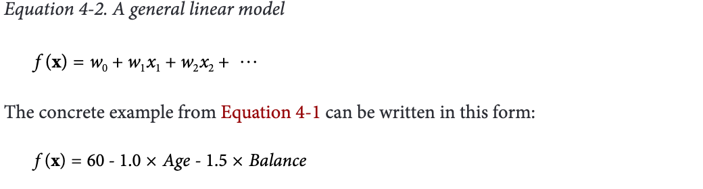

# Week2 
## Chapter 3: Introduction to Predictive Modeling: From Correlation to Supervised Segmentation

Fundamental Concepts: 
- Identifying informative attributes
- Segmenting data by progressive attribute selection
- Finding Correlations
- Attribute/Variable Selection
- Tree induction

This chapter is focusing on ***Modeling***

#### Models, Induction, and Prediction

A model is simplified representation of reality created to serve a purpose.
For example, Map. 

In data science,a predictive model is a formula for estimating the unknown value of interest: ***the target***.

The formula could be mathematical, or it could be a logical statement such  as  a  rule. (Could be Hybird) Via the formula, it makes supervised data mining into classfication model and regression model

This is in contrast to descriptive modeling, where the primary purpose of the model is not to estimate a value but instead to gain insight into the underlying phenomenon or process. 

There are some terminology 

|terminology| Defination|
|---|---|
|attributes or features|a set of selected variables |
|target| predefined variable  |
|function |possibly a probabilistic function|

What it means?Here is example

Supervised learning is model creation where the model describes a relationship between a set of selected variables (attributes or features) and a predefined variable called the target variable. The model estimates the value of the target variable as a function (possibly a probabilistic function) of the features

#### Supervised Segmentation

The aims is try to segment the population into subgroups that have different values for the target variable

If the segmentation is done using values of variables that will be known when the target is not, then these segments can be used to predict the value of the target variable.Moreover, the segmentation may at the same time provide a human-understandable set of segmentation patterns.

Example:
“Middle-aged professionals who reside in New York City on average
have a churn rate of 5%.”

***“middle-aged professionals who reside in New York City”***
is the definition of the segment

***"a churn rate of 5%”*** describes the predicted value of the target variable for the segment

#### Selecting Informative Attributes

***how can we judge whether a variable contains  important  information  about  the  target  variable?  How  much?  how  do  we  select  an  attribute  to  partition  them  in  an informative way?*** 

Let’s consider a binary (two class) classification problem

Figure 3-2 shows a simple
segmentation problem: 
twelve people represented as stick figures. 

There are two types of heads: 
- square 
- circular; 

and two types of bodies: 
- rectangular 
- oval; 

and two of body color
- 2 gray bodies 
- 10 white bodies

We could translate the data to table :

|head-shape|body-shape|body-color|write-off|
|---|---|---|---|
|square |rectangular |gray|Yes|
|square|oval|white|No|
........

We want to use attributes to segement the Target (Write-off). But which is the best

We would like the resulting groups to be as ***pure*** as possbile
By pure we mean homogeneous(同一，同質) with respect to the target variable. If every member of a group has the same value for the target, then the group is ***pure***.If there is at least one member of the group that hasa  different  value  for  the  target  variable  than  the  rest  of  the  group,  then  the  group  is ***impure.***

However, world does not have pure data. We just predict with higher possibility 

There are several complications:

- Attributes rarely split a group perfectly. Even if one subgroup happens to be pure, the other may not. 

    Take back the example:  if the second person were not there. Then body-color=gray would create a pure segment(write-off=no). However, the other associated segment, body-color=white, still is not pure.

- Is this better than another split that does not produce
any pure subset, but reduces the impurity more broadly?

    the condition body-color=gray only splits off one single data point into the pure subset

- How do we compare these atrributes?
    
     Not all attributes are binary; many attributes have three or more distinct values. Wemust take into account that one attribute can split into two groups while another might split into three groups, or seven. 

But creating the model(formula), by evaluates how well each attribute splits a set of examples into segments, with respect to a chosen target variable. 

##### Information gain

The most common splitting criterion is called ***information gain***, and it is based on a purity measure called ***entropy***.

***Entropy*** is a measure of disorder that can be applied to a set, such as one of our individual segments. 

Example: 

Figure 3-3 shows a plot of the entropy of a set containing 10 instances of two classes, + and –. We can see then that entropy measures the general disorder of the set, ranging from zero at minimum disorder (the set has members all with the same, single property) to one at maximal disorder (the properties are equally mixed). 

As a concrete example, consider a set S of 10 people with seven of the non-write-off class and three of the write-off class. So:

We need to use Entropy to measure ***how informative an attribute
is with respect to our target***: how much gain in information it gives us about the value of the target variable. 

An attribute segments a set of instances into several subsets. Entropy ***only tells us how impure one individual subset is***

Information Gain(IG) measure how much an attribute improves (decreases) entropy over the whole segmentation it creates.
In other words:  information gain measures ***the change in entropy*** due to any amount of ***new information being added***;

Example:

As an example, consider the split in Figure 3-4. This is a two-class problem (• and ★).
Examining the figure, the children sets certainly seem “purer” than the  parent set. The parent set has 30 instances consisting of 16 dots and 14 stars, so: 

if we decides to use another feature to calculate on Residence with three values: OWN, RENT, and OTHER.

The Residence variable does have a positive information gain, but ***it is lower than that of Balance***. Intuitively, this is because, while the one child Residence=OWN has considerably reduced entropy, the other values RENT and OTHER produce children ***that are no more pure than the parent.*** Thus, based on these data, the ***Residence variable is less informative than Balance.***

However, Information Gain is not suitable on Target is numeric 

For a dataset with instances described by attributes and a target variable, we can determine which attribute is the most informative with respect to estimating the value of the target variable. (We will  delve  into  this  more  deeply  below.)  We  also  can  rank  a  set  of  attributes  by  their informativeness,  in  particular  by  their  information  gain.  This  can  be  used  simply  to understand the data better. It can be used to help predict the target. Or it can be used to reduce the size of the data to be analyzed, by selecting a subset of attributes in cases where we can not or do not want to process the entire dataset.

#### More complicated Example: Ranking the feature
It is a dataset describing edible and poisonous mushrooms. Each data example (instance) is one mushroom sample, described in terms of its ob‐
servable attributes (the features). The twenty-odd attributes and the values for each are listed in Table 3-1.

We use 5,644 examples from the dataset, comprising 2,156 poisonous and 3,488 edible mushrooms.

This is a classification problem because we have a target variable, called edible?, with two values yes (edible) and no (poisonous), specifying our two classes. 

“Which single attribute is the most useful for distinguishing edible
(edible?=Yes) mushrooms from poisonous (edible?=No) ones?” 

 we are asking for the single attribute that gives the highest information gain

First we need entropy(parent), the entropy of the whole dataset. If the two classes were perfectly balanced in the dataset it would have an entropy of 1. This dataset is slightly unbalanced (more edible than poisonous mushrooms are represented) and its entropy is 0.96

On the x axis is the proportion of the dataset (0 to 1), and on the y axis is the entropy (also 0 to 1) of a given piece of the data.

The width of each attribute represents what proportion of the dataset has that value, and the height is its entropy.

The amount of shaded area in each graph represents the amount of entropy in the dataset when it is divided by some chosen attribute 

For our entire dataset, the global entropy is 0.96, so Figure 3-6 shows a large shaded area below the line y = 0.96. We can think of this as our starting entropy—any informative attribute should produce a new graph with ***less shaded area.***

We  can  see  that  GILL-COLOR  reduces  the  entropy  somewhat;  the  shaded  area  in Figure 3-7 is considerably less than the area in Figure 3-6.

Similarly,  Figure  3-8  shows  how  SPORE-PRINT-COLOR  decreases  uncertainty  (entropy). A few of the values, such as h (chocolate), specify the target value perfectly and thus produce zero-entropy bars. But notice that they don’t account for very much of the population, only about 30%

Figure  3-9 shows  the  graph  produced  by  ODOR.  Many  of  the  values,  such  as  a  (al
mond), c (creosote), and m (musty) produce zero-entropy partitions; only n (no odor) has  a  considerable  entropy  (about  20%).
In  fact,  ODOR  has  the  highest  information gain of any attribute in the Mushroom dataset. It can reduce the dataset’s total entropy
to about 0.1, which gives it an information gain of 0.96 – 0.1 = 0.86. 

#### More complicated Example: Tree-Structured Model
 attribute selection alone does not seem to
be sufficient. If we select the single variable that gives the most information gain, we create  a  very  simple  segmentation. If  we  select  multiple  attributes  each  giving  some information gain, it’s not clear how to put them together.

 
 
Consider how we would use the classification tree in Figure 3-10 to classify an exampleof  the  person  named  Claudio  from  Figure  3-1.  The  values  of  Claudio’s  attributes  are Balance=115K, Employed=No, and Age=40. 

We begin at the root node that tests Employed. Since the value is No we take the right branch. The next test is Balance. The value of Balance is 115K, which is greater than 50K so we take a right branch again to a node that tests Age. The value is 40 so we take the left branch. This brings us to a leaf node specifying class=Not Write-off, representing a prediction that Claudio will not default.

Another way of saying this is that we have classified Claudio into a segment defined by (Employed=No, Balance=115K, Age<45) whose classification is Not Write-off.

#### Probability Estimation

In many decision-making problems, we would like a more informative prediction than just a classification. We want probability 

you might then rank prospects by their probability of leaving, and then allocate a limited incentive budget to the highest  probability  instances. 

#### Example: Addressing the Churn Problem with Induction

For  this  example,  we  have  a  historical  data  set  of  20,000  customers.  At  the  point  of collecting  the  data,  each  customer  either  had  stayed  with  the  company  or  had  left(churned). 

Type Target:
- Stay
- Leave

Features:

- Step1 : How good are each of these variables individually? 
  For this we measure the information gain of each attribute
  
  the first three variables—the house value, the number of leftover minutes, and the number of long calls per month—have a higher information gain than the rest.

- Step2 : Applying a classification tree algorithm to the data

  The highest information gain feature (HOUSE) according to Figure 3-17 is at the root of the tree. This is to be expected since it will always be chosen first. The second best feature, OVERAGE, also appears high in the tree. However, the order in which  features  are  chosen  for  the  tree  doesn’t  exactly  correspond  to  their  ranking  in Figure 3-17. Why is this?

  The answer is that the table ranks each feature by how good it is independently, evaluated separately on the entire population of instances. 
  
  Nodes in a classification tree depend on the instances above them in the tree. Therefore, except for the root node, features in a  classification  tree  are  not  evaluated  on  the  entire  set  of  instances.  The  information gain of a feature depends on the set of instances against which it is evaluated, so the ranking of features for some internal node may not be the same as the global ranking

  How many leaf node we need? The  dataset  has 20,000 examples yet the tree clearly doesn’t have 20,000 leaf nodes.  but we should stop long before the model becomes that complex. 
  
  This issue ties in closely with model generality and overfitting, whose discussion we defer to week 3 

- Step3: we measured its accuracy against the data to see how good of a model it is.

  

  The tree achieved 73% accuracy on its decisions. This raises two questions:

  1. First, do you trust this number? If we applied the tree to another sample of 20,000 people from the same dataset, do you think we’d still get about 73% accuracy?
  
  2. If you do trust the number, does it mean this model is good? In other words, is a model with 73% accuracy worth using?

  we will revisit in Week 4 

## Chapter 4 : Fitting a Model to Data

Fundamental  concepts:

- Finding “optimal”  model  parameters  based  on  data
- Choosing the goal for data mining;
- Objective Functions
- Loss Functions
- Linear Regression
- Logistic regression
- Support-vector machines

It also focusing on Model. But specific in parameterized model

### Classification via Mathematical Function 

Recall the instance-space view of tree model. 

It shows the space broken up into regions by horizontal and
vertical decision boundaries that partition the instance space into similar regions.

we saw how the entropy measure gives us a way of measuring homogeneity(同質的) so we can choose such boundaries.

A main purpose of creating homogeneous regions is so that we can predict the target variable of a new, unseen instance by determining which segment it falls into.

Actually, we could use the instace space to found a better boundaries.

We can use ***Age = Balance * 1.5 + 60 as a boundaries***

And it is called a linear classifier

### Linear Disciminant function 

So that for above example. We could represent a model using 

- 

This is called a linear discriminant because it discriminates between the classes, and the function  of  the  decision  boundary  is  a  linear  combination—a  weighted  sum—of  the attributes. 

In the two dimensions of our example, the linear combination corresponds to a line. In three dimensions, the decision boundary is a plane, and in higher dimensions it is a hyperplane

A linear discriminant function is a numeric classification model

To use this model as a linear discriminant, for a given instance represented by a feature vector x, we check whether f(x) is positive or negative

And since the Weight(w) is parameter and feature(x) is provided. we need to turning the parameter to seperate the instance. And it is so-called "Parameterized model" 

if  a  feature’s  weight  is  near  zero  the  corresponding feature can usually be ignored or discarded.

But what is the best line ? 

There is some many line(parameter) could suit the train data(instances)

We need Optimizing Objective Function 

### Optimizing an Objective Function
Our question is coming from :

***what should be our goal or objective in choosing the parameters?***

In shorts:

- what weights should we choose

To ask this question it will be in week3, just familiar with the parameterized function in this week

Some famous objective function:

- SVM
- linear regression
- Logistic Regression : it is the estimation of a numeric target value and applies linear models to class probability estimation

### Example: Linear regression 
For this illustration we’ll use just two species of irises, Iris Setosa and Iris Versicolor. The dataset describes a collection of flowers of these two species, each described with two measurements: the Petal width and the Sepal width (Figure 4-6). 

Once we plot with these two attributes on the x and y axis, respectively. 
Each instance is one flower and corresponds to one dot on the graph. The filled dots are of the species Iris Setosa and the circles are instances of the species Iris Versicolor

-  Logistic regression separates the two classes completely: all the Iris Versicolor examples are to the left of its line and all the Iris Setosa to the right. 

-  The Support vector machine line is almost midway between the clumps, though it misclassifies the starred point at (3, 1).

Again, which is better. we will describe on week3

### Linear Discriminat Functions for Soring and Ranking Instances

We want some notion of which examples are more or less likely
to belong to the class. For example, which consumers are most likely to respond to this offer? Which customers are most likely to leave when their contracts expire? 

One option is to build a model that produces an estimate of class membership probability.We simply need a score that will rank cases by the likelihood of belonging to one class or the other.

### Support Vector Machiens

In short, support vector machines are linear discriminants. 
As with linear discriminants generally, SVMs classify instances based on a linear func‐ tion of the features, described above in Equation 4-2.

what is the objective function that is used to fit an SVM to data? 

SVMs  choose  based  on  a simple, elegant idea: instead of thinking about separating with a line, first fit the fattest bar between the classes. This is shown by the parallel dashed lines in Figure 4-8

The SVM’s objective function incorporates the idea that a wider bar is better. Then once the widest bar is found, the linear discriminant will be the center line through the bar (the solid middle line in Figure 4-8).

The distance between the dashed parallel lines is called the ***margin*** around the linear discriminant, and thus the objective is to maximize
the margin

The idea of maximizing the margin is intuitively satisfying for the following reason. 

- The training dataset is just a sample from some population. In predictive modeling, we are interested in predicting the target for instances that we have not yet seen. These instances will be scattered about.Hopefully they will be distributed similarly to the training data,
but they will in fact be different points. ***In other words,
they may fall in the margin.***The margin-maximizing boundary gives the maximal leeway for classifying such points. 

- The second important idea of SVMs lies in how they handle points falling on the wrong side of the discrimination boundary. This does not pose a problem for the general notion of linear discriminants, as their classifications don’t necessarily have to be correct for all points. There may be no such perfectseparating line! ***But not in SVM***

    In the objective function that measures how well a particular model fits the training points, we will simply penalize a training point for being on the wrong  side  of  the  decision  boundary. 

    if  the  data  are  not linearly separable, the best fit is some balance between a fat margin and a low total error penalty.

    The penalty for a misclassified point is proportional to the distance from the margin boundary, so if possible the SVM will make only “small” errors. Technically, this error  function  is  known  as  hinge  loss

    

### Loss Function

The term “loss” is used across data science as a general term for error penalty. A loss function determines how much penalty should be assigned to an instance based on the error in the model’s predicted value—in our present context, based on its distance from the separation boundary. 

 

 In the figure, the horizontal axis is the distance from the separating boundary.

 Errors have positive distances from the separator in Figure 4-9, while correct classifications have negative distances (the choice is arbitrary in this diagram).

 Hinge loss incurs no penalty for an example that is not on the wrong side of the margin. The hinge loss only becomes positive when an example is on the wrong side of the boundary and beyond the margin. oss then increases linearly with the example’s distance from the margin, thereby penalizing points more the farther they are from the separating boundary
 

Zero-one loss, as its name implies, assigns a loss of zero for a correct decision and one for an incorrect decision 

Squared  error  specifies  a  loss proportional to the square of the distance from the boundary.

Squared error loss usually is used for numeric value prediction (regression), rather than classification. 

### Regression via Mathematical Functions

Again Linear regression model structure is exactly the same as for   linear  discriminant  function

we need to decide on the objective function we will use to optimize the model’s fit to the data.

Each different linear regression modeling procedure uses one particular choice

The  most  common  (“standard”)  linear  regression  procedure  makes  a  powerful  and convenient choice. Standard linear regression procedures instead minimize the sum or mean of the squares of these errors—which gives the procedure its common name “least squares” regressiom --- convenience. 

Often, more importantly, it turns out that squared error is particularly convenient mathematically.

### Class Probability Estimation and Logistic “Regression”

Fortunately, within this same framework for fitting linear models to data, by choosing a different objective function we can produce a model designed to give accurate estimates of class probability. The most common procedure by which we do this is called logistic regression.

Exactly what is the problem with simply using our basic linear model to estimate the class probability? 

An instance being further from the separating boundary intuitively ought to lead to a higher probability of being in one class or the other, and the output of the linear function, f(x), gives the distance from the separating boundary

However,  this  also  shows  the  problem:  f(x)  ranges  from  –∞  to  ∞,  and  a  probability should range from zero to one.

One very useful notion of the likelihood of an event is the odds. The odds of an event is the ratio of the probability of the event occurring to the probability of the event not occurring. for example, if the event has an 80% probability of occurrence, the odds are 80:20 or 4:1

the odds range from 0 to ∞. Nonetheless, we can solve our garden-path problem simply by taking the logarithm of the odds (called the “log-odds”), since for any number in the range 0 to ∞ its log will be between –∞ to ∞.

### Example: Logistic Regression vs Tree Induction
Though classification trees and linear classifiers both use linear decision boundaries,
there are two important differences between them:
1. A classification tree uses decision boundaries that are perpendicular to the instance-
space axes (see Figure 4-1), whereas the linear classifier can use decision boundaries
of any direction or orientation (see Figure 4-3). This is a direct consequence of the
fact that classification trees select a single attribute at a time whereas linear classifiers
use a weighted combination of all attributes.
2. A classification tree is a “piecewise” classifier that segments the instance space re‐
cursively when it has to, using a divide-and-conquer approach. In principle, a clas‐
sification tree can cut up the instance space arbitrarily finely into very small regions
(though we will see reasons to avoid that in Chapter 5). A linear classifier places a
single decision surface through the entire space. It has great freedom in the orien‐
tation of the surface, but it is limited to a single division into two segments. This is
a direct consequence of there being a single (linear) equation that uses all of the
variables, and must fit the entire data space
