# Week3 
## Chapter 4: Overfitting and its Avoidance

Fundamental Concepts: 
- Generalization
- Fitting and overfitting;
- Complexity control
- Cross-validation
- Attribute selection
- Tree pruning
- Regularization

This chapter is focusing on ***Evaluation***

Remember Week2 leaving question :

- what weights should we choose?

This chapter is aims to solve this question

### Generalization

Taking a (Extreme) Example, MegaTelCo, it want to reducing churn. 
Does 100% accurate model is the best ?

We have consider about the ***Generalization*** and ***Overfitting***
Generalization is the property of a model or modeling process, whereby the model applies to data that were not used to build the model. 

100% accurate model means that does not generalize at all beyond the data
that were used to build it. ***It is tailored***, or “fit,” perfectly to the training data. In fact, it is “overfit.” Every dataset ***is a finite sample of a population***. We  want  models  to  apply  **not  just  to  the  exact
training set but to the general population** from which the training data came.

### Overfitting

Overfitting is the tendency of data mining procedures to ***tailor models to the training data***,  at  the  expense  of  generalization  to  previously  unseen  data  points.

### Overfitting Examined - Holdout Data and Fitting Graphs

A fitting graph shows the accuracy  of  a  model  as  a  function  of  complexity.
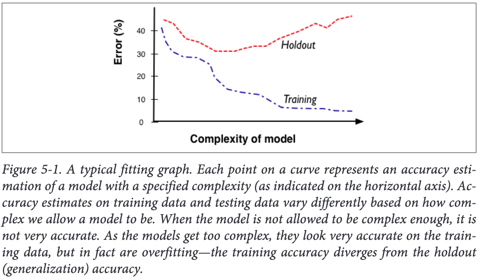
    
Holdout data can help to exams overfitting.What we need to do is to “hold out” some data for which we know the value of the target variable, but which will  not  be  used  to  build  the  model.

So building model is ***training set*** and holdout data is ***test set***

### Overfitting in Tree Induction

We applied a fundamental ability  to  find  important,  predictive  individual  attributes  repeatedly  (recursively)  to smaller and smaller data subsets.(Every leaf).Any training instance given
to the tree for classification will make its way down, eventually landing at the appropriate leaf—the leaf corresponding to the subset of the data that includes this particular training instance.

A procedure that grows trees until the leaves are pure tends to overfit. Tree-structured models  are  very  flexible  in  what  they  can  represent.he complexity of the tree lies in the number of nodes.

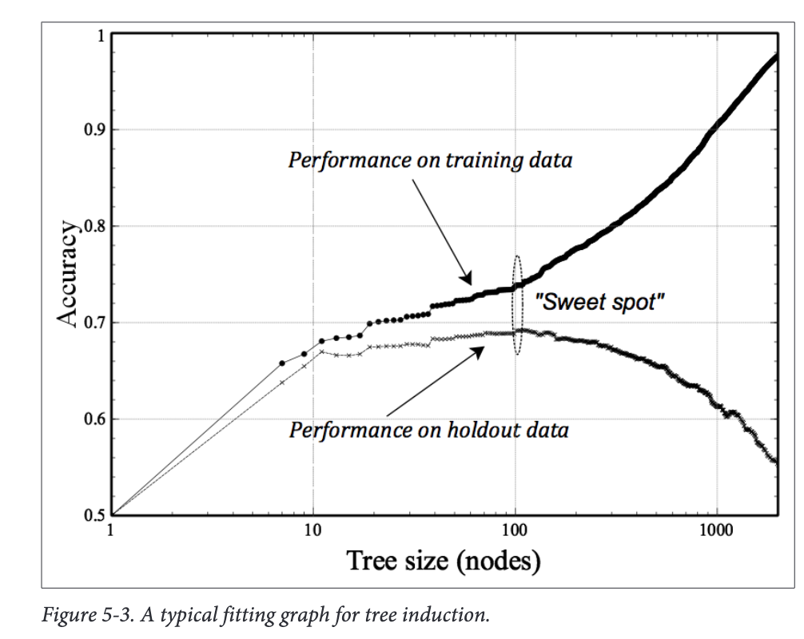

As the trees are allowed to get larger, the training-
set accuracy continues to increase—in fact, it is capable of memorizing the entire training set if we let it, leading to an accuracy of 1.0 (not shown). But the holdout accuracy declines as the tree grows past its “sweet spot”; the data subsets at the leaves get smaller and smaller, and the model generalizes from fewer and fewer data. 

We  should  restrict  tree  size  to  this  value.  This represents the best trade-off between the extremes of 
1. not splitting the data at all and
simply using the average target value in the entire dataset, and 
2. building a complete tree out until the leaves are pure.

### Overfiting in Mathematical Functions

One way mathematical functions can become more complex is by adding more variables (more  attributes). 
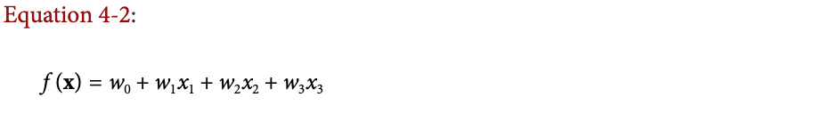
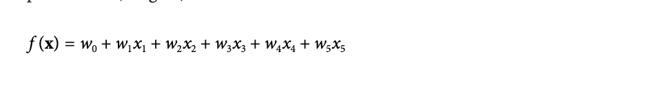

As we add more xi’s, the function becomes more and more complicated. Each xi has a corresponding wi, which is a learned parameter of the model

This concept generalizes: as you increase the dimensionality, you can perfectly fit larger and larger sets of arbitrary points.

Example: Overfitting Linear Functions
At First:
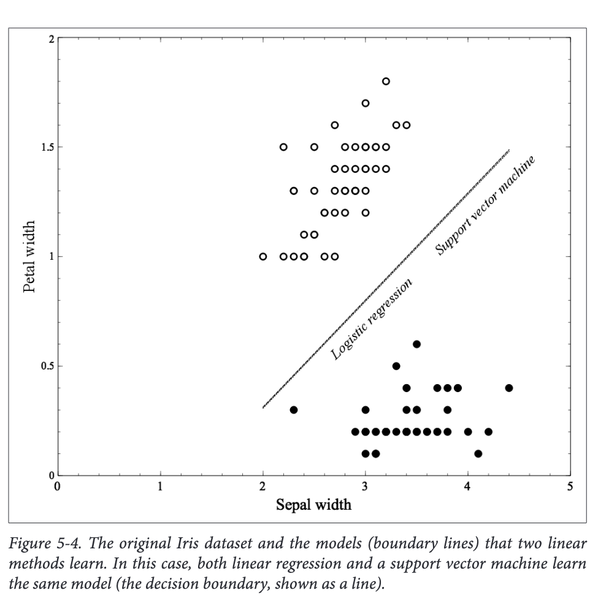

Then we add a new data at (3,1)
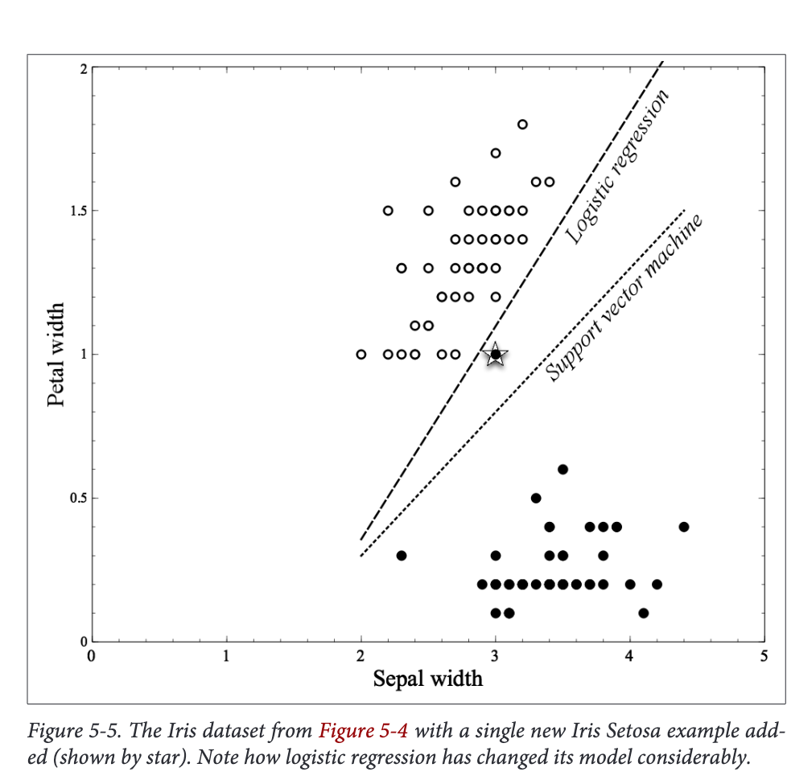
Notice how the logistic regression line moves in response: it separates the two groups perfectly, while the SVM line barely moves at all.

Then we add another point at (4,07)
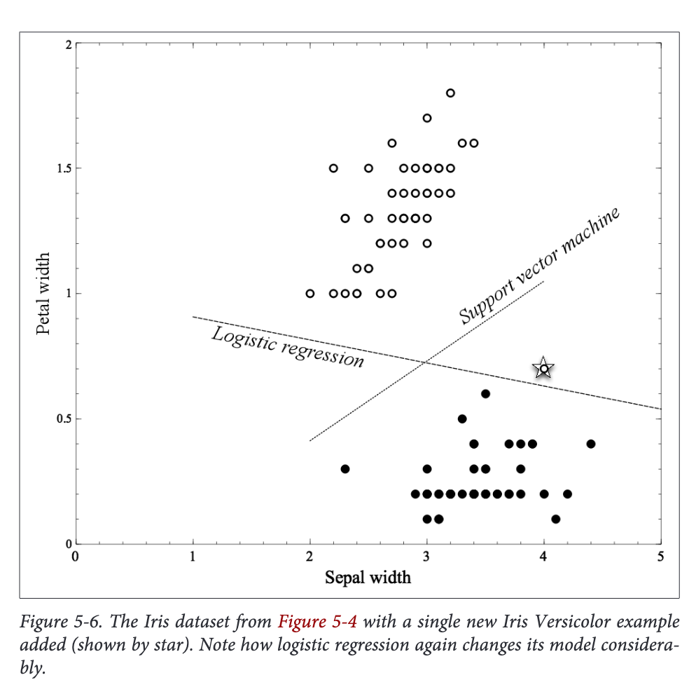
Again, the support vector machine line moves very little in response, but the logistic regression line moves considerably.

In Figure 5-5 and Figure 5-6, Logistic regression appears to be overfitting. Arguably, the examples introduced in each are outliers that ***should not have a strong influence on the model***—they contribute little to the “mass” of the species examples.

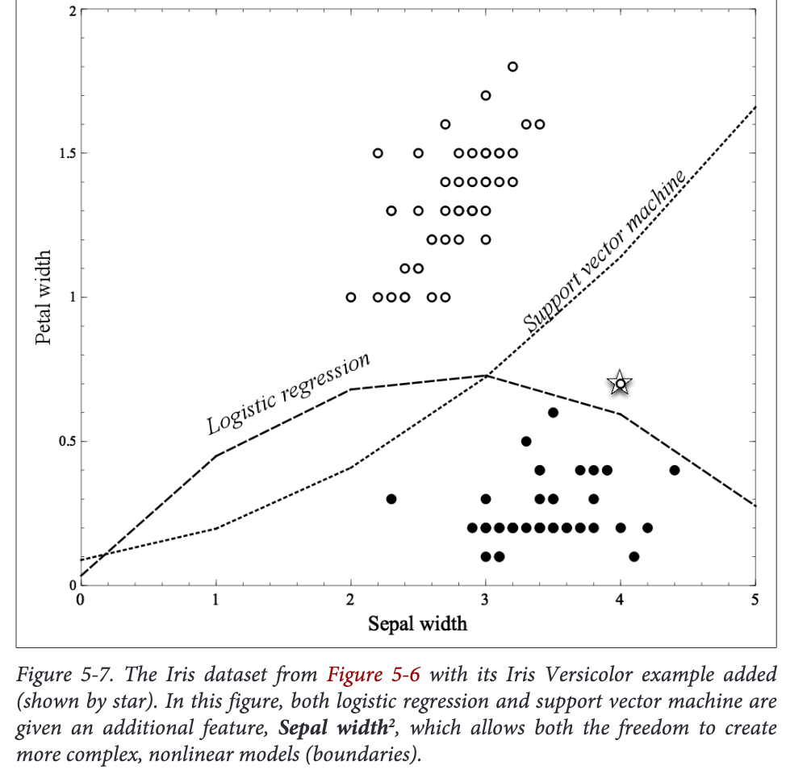

In Figure 5-7, we have done just this: we used the same dataset as  in  Figure  5-6  but  we  added  ***a  single  extra  attribute***

In cases where curved surfaces may be necessary, this freedom may be necessary, but it also gives the methods far more opportunity to overfit. Note however that the SVM, even though its boundary now is curved, the training procedure still has opted for the larger margin around the boundary, rather than the perfect separation of the positive different classes.

### Why is Overfitting bad

Why Overfitting does performance degrade? The short answer is that as a model gets more complex
it is allowed to pick up harmful spurious correlations.

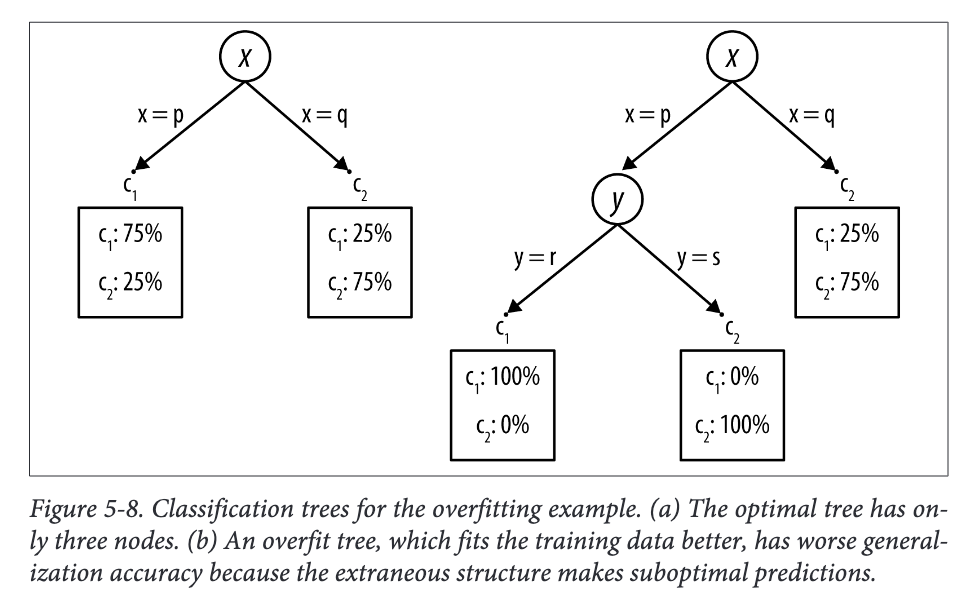

### From Holdout Evaluation to Cross-validation

While a holdout set will indeed give us an estimate of generalization performance, it is
just  a  single  estimate.  Should  we  have  any  confidence  in  a  single  estimate  of  model
accuracy? 

Cross-validation  is  a  more  sophisticated  holdout  training  and  testing  procedure. 
We would like not only a simple estimate of the generalization performance, but also some statistics on the estimated performance, such as the mean and variance, so that we can understand how the performance is expected to vary across datasets. 

Cross-validation also makes better use of a limited dataset. Unlike splitting the data into one training and one holdout set, cross-validation computes its estimates over all the data by performing multiple splits and systematically swapping out samples for testing.

Cross-validation begins by splitting a labeled dataset into k partitions called folds. Typically, k will be five or ten
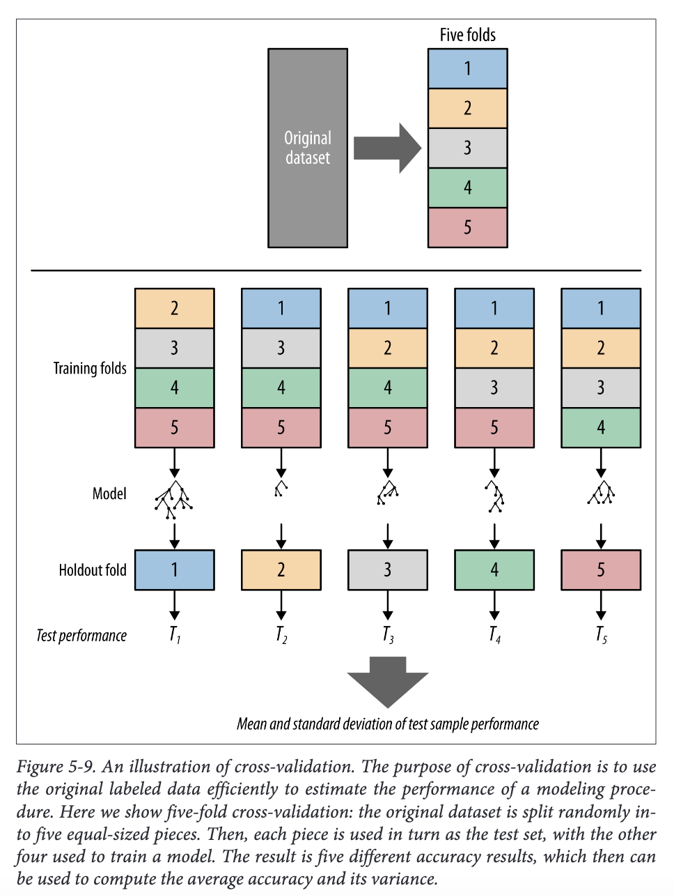

Each iteration produces one model, and thereby one estimate of generalization performance, for example, one estimate of accuracy. When cross-validation is finished, every example will have been used only once for testing but k–1 times for training. At this point  we  have  performance  estimates  from  all  the  k  folds  and  we  can  compute  the average and standard deviation.

### The Churn Dataset Revisited

In week2, we provides a tree induction and we reported an accuracy of 73%. 

Does we trust this number?

By this point you should know enough to mistrust any performance measurement done on the training set, because overfitting is a very real possibility. Now that we have introduced cross-validation we can redo the evaluation more carefully.

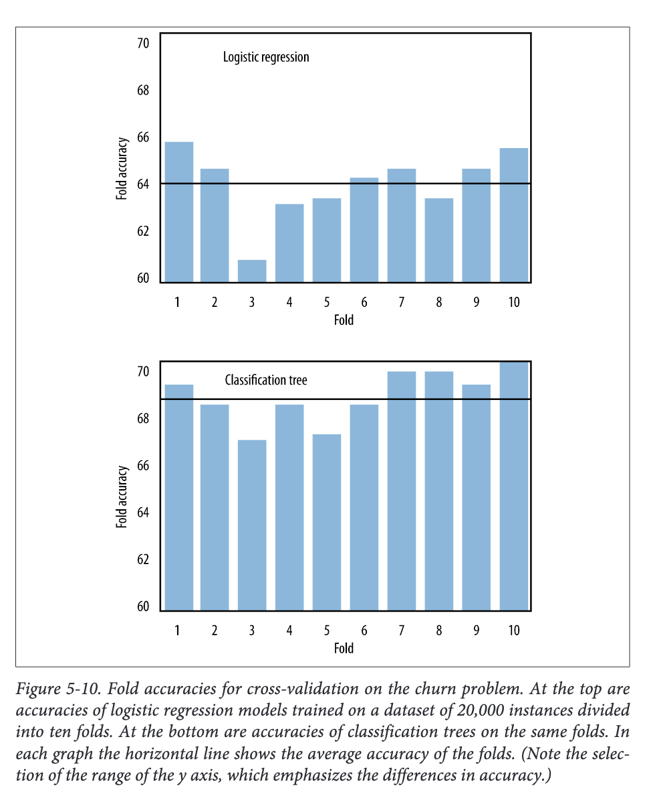

Figure 5-10 shows the results of ten-fold cross-validation. In fact, two model types are shown.  The  top  graph  shows  results  with  logistic  regression,  and  the  bottom  graph shows results with classification trees. 

First, the average accuracy of the folds with classification  trees  is  68.6%—significantly  lower  than  our  previous  measurement  of 73%. This means there was some overfitting occurring with the classification trees, and this  new  (lower)  number  is  a  more  realistic  measure  of  what  we  can  expect. 

Second,there is variation in the performances in the different folds (the standard deviation of the fold accuracies is 1.1), and thus it is a good idea to average them to get a notion of the performance as well as the variation we can expect from inducing classification trees on this dataset.

Finally, compare the fold accuracies between logistic regression and classification trees. There are certain commonalities in both graphs—for example, neither model type did very well on Fold Three and both performed well on Fold Ten. But there are definite differences  between  the  two.  An  important  thing  to  notice  is  that  logistic  regression models show slightly lower average accuracy (64.1%) and with higher variation (standard deviation of 1.3) than the classification trees do

On this particular dataset, trees may  be  preferable  to  logistic  regression  because  of  their  greater  stability  and  performance. But this is not absolute; other datasets will produce different results, as we shall see.

### learning Curves
If the training set size changes, you may also expect different generalization performance from the resultant model. 

All else being equal, the generalization performance of data driven  modeling  generally  improves  as  more  training  data  become  available,  up  to  a point. A plot of the generalization performance against the amount of training data is called a learning curve. The learning curve is another important analytical tool.

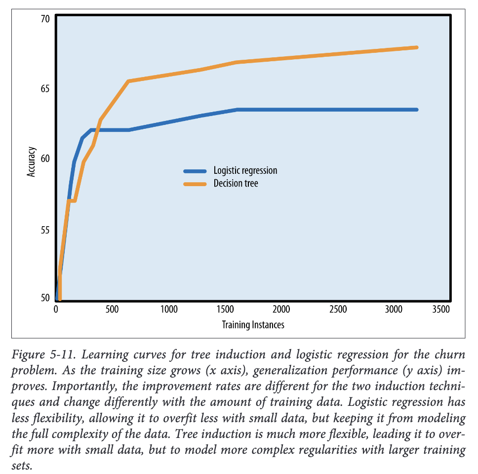
Learning curves for tree induction and logistic regression are shown in Figure 5-11 for
the telecommunications churn problem
