# Week4 
## CHAPTER 7: Decision Analytic Thinking I: What Is a Good Model?

Fundamental concpets: 

1. Careful consideration of what is desired from data science results;
2. Expected value as a key evaluation framework
3. Consideration of appropriate comparative baselines
4. Various evaluation metrics
5. Estimating costs and benefits
6. Calculating expected profit;
7. Creating baseline methods for comparison

We will work through a set of such frameworks and metrics for tasks of classification (in this chapter) and instance scoring (e.g., ordering consumers by their likelihood of responding to an offer), and class probability estimation (in the following chapter).

### Evaluating Classifiers

Let’s consider binary classification, for which the classes often are
simply called “positive” and “negative.” How shall we evaluate how well such a model performs?we should use a holdout test set to assess the generalization performance of the model. But how should we measure generalization performance?

#### Plain Accuracy and Its Problems
The term “classifier accuracy” is sometimes used informally to mean any general measure  of  classifier  performance.  Here  we  will  reserve  accuracy  for  its  specific  technical meaning as the proportion of correct decisions

This is equal to 1–error rate. Accuracy is a common evaluation metric that is often used in data mining studies because it reduces classifier performance to a single number and it  is  very  easy  to  measure.  Unfortunately,  it  is  simplistic  and  has  some  well-known problems.For this we use the confusion matrix

#### Confustion matrix

A confusion matrix for a problem involving n classes is an n × n matrix with the columns labeled with actual classes and the rows labeled with predicted classes. 

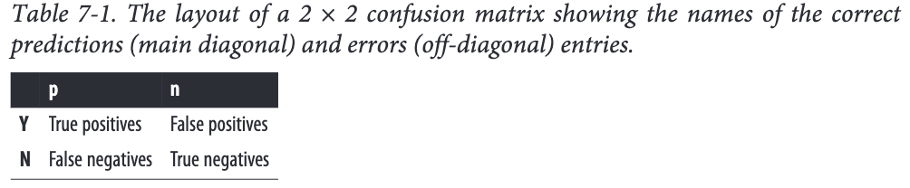

We will consider two-class problems, and will denote  the  true  classes  as  p(ositive)  and  n(egative),  and  the  classes  predicted  by  themodel (the “predicted” classes) as Y(es) and N(o), respectively (think: the model says “Yes, it is a positive” or “No, it is not a positive”).

The errors of the classifier are the false positives (negative instances classified as pos‐ itive) and false negatives (positives classified as negative).

### Problems with Unbalanced Classes
As an example of how we need to think carefully about model evaluation, consider a classification problem where one class is rare.
Unfortunately, as the class distribution becomes more skewed, evaluation based on accuracy breaks down.

Chapter 5 mentioned the “base rate” of a class, which corresponds to how well a classifier would  perform  by  simply  choosing  that  class  for  every  instance.With  such  skewed domains the base rate for the majority class could be very high, so a report of 99.9% accuracy may tell us little about what data mining has really accomplished

For example:
 my coworker’s model (call it Model A) achieves 80% accuracy on the balanced sample by correctly identifying all positive examples but only 60% of the negative examples. My model (Model B) does this, conversely, by correctly identifying all the negative examples but only 60% of the positive examples

 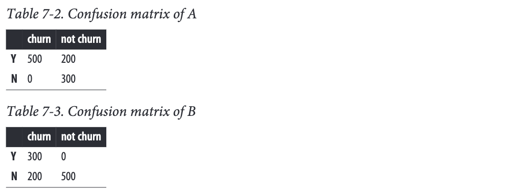

 Classifier A often falsely predicts that customers will churn when they will not, while  classifier  B  makes  opposite  errors  of  predicting  that  customers  will  not  churn when  in  fact  they  will.  When  applied  to  the  original,  unbalanced  population  of  customers, model A’s accuracy declines to 64% while model B’s rises to 96%. This is a huge change. So which model is better?

 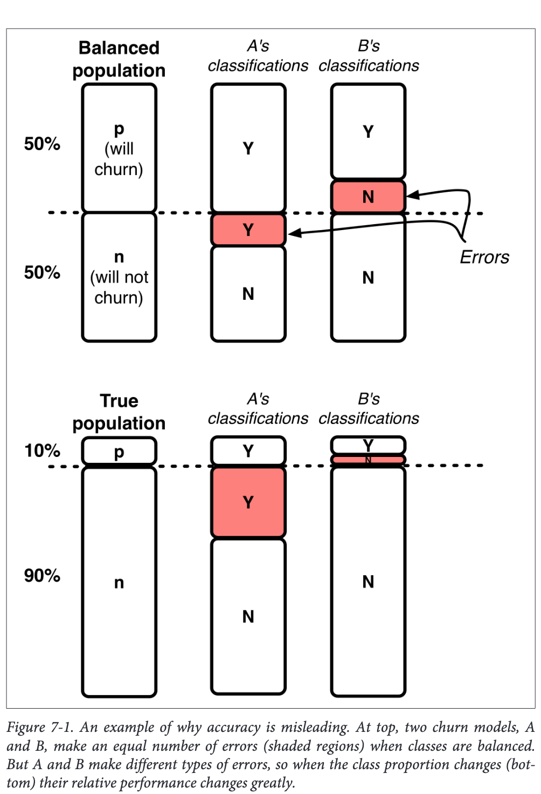

My model (B) now appears to be better than A because B seems to have greater performance on the population we care about—the 1:9 mix of customers we expect to see. But we still can’t say for sure because of another problem with accuracy: we don’t know how much we care about the different errors and correct decisions. It will explain in chapter 8

### Problems with Unequal Costs and Benefits

Another  problem  with  simple  classification  accuracy  as  a  metric  is  that  it  makes  no distinction between false positive and false negative errors.

By counting them together, it makes the tacit assumption that both errors are equally important. With real-world domains this is rarely the case.  These are typically very different kinds of errors with very different costs because the classifications have consequences of differing severity.

Ideally, we should estimate  the  cost  or  benefit  of  each  decision  a  classifier  can  make.  Once  aggregated,these will produce an expected profit (or expected benefit or expected cost) estimate for the classifier

### A Key Analytical Framework: Expected Value
The expected value computation provides a framework that is extremely useful in organizing thinking about data-analytic problems. 

Specifically, it
decomposes data-analytic thinking into 
1. the structure of the problem, 
2. the elements of the analysis that can be extracted from the data
3. the elements of the analysis that need to be acquired from other sources (e.g., business knowledge of subject matter experts)

The expected value is then the weighted average of the values of the different possible outcomes,  where  the  weight  given  to  each  value  is  its  probability  of  occurrence.

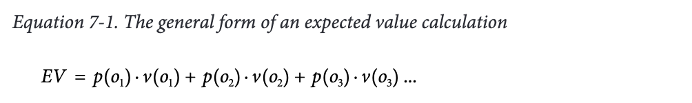
Each oi is a possible decision outcome; p(oi) is its probability and v(oi) is its value.

The probabilities often can be estimated from the data (ii),
The business values often need to be acquired from other sources (iii).

#### Using Expected Value to Frame Classifier Use
For targeted  marketing  often  the  probability  of response for any individual consumer is very low—maybe one or two percent—so no consumer may seem like a likely responder. If we choose a “common sense” threshold of 50% for deciding what a likely responder is, we would probably not target anyone.Many  inexperienced  data  miners  are  surprised  when  the  application  of  data  miningmodels results in everybody being classified as not likely responder (or a similar negativeclass).

However, with the expected value framework we can see the crux of the problem.  Let’s walk through a targeted marketing scenario

Consider that we have an offer for a product that, for simplicity, is only available via this offer. If the offer is not made to a consumer, the consumer will not buy the product. We have a model, mined from historical data, that gives an estimated probability of response ( pR (x)) for any consumer whose feature vector description x is given as input.

Expected  value  provides  a  framework  for  carrying  out  the  analysis.  Specifically,  let’s calculate the expected benefit (or cost) of targeting consumer x

where vR is the value we get from a response and vNR is the value we get from no response.Since everyone either responds or does not, our estimate of the probability of not re‐
sponding is just ((1 - pR (x))).The benefits vR and vNR need to be determined separately, as part of the Business Understanding step

To be concrete, let’s say that a consumer buys the product for $200 and our product related costs are $100. To target the consumer with the offer, we also incur a cost. Let’s say that we mail some flashy marketing materials, and the overall cost including postageis $1, yielding a value (profit) of vR = $99 if the consumer responds (buys the product).

Now, what about vNR, the value to us if the consumer does not respond? We still mailed the marketing materials, incurring a cost of $1 or equivalently a benefit of -$1.

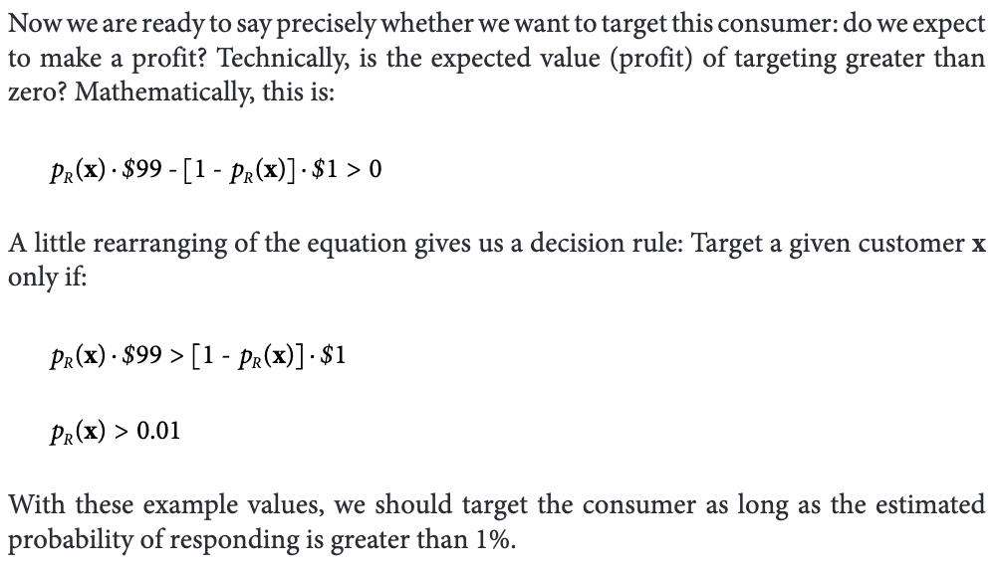

#### Using Expected Value to Frame Classifier Evaluation

At  this  point  we  want  to  shift  our  focus  from  ***individual  decisions  to  collections  of decisions.***
Specifically, we need to ***evaluate the set of decisions made by a model*** when applied to a set of examples. Such an evaluation is necessary in order to ***compare one model to another.***.e.g <mark>Does a classification tree work better than a linear discriminant model for a particular problem? </mark>

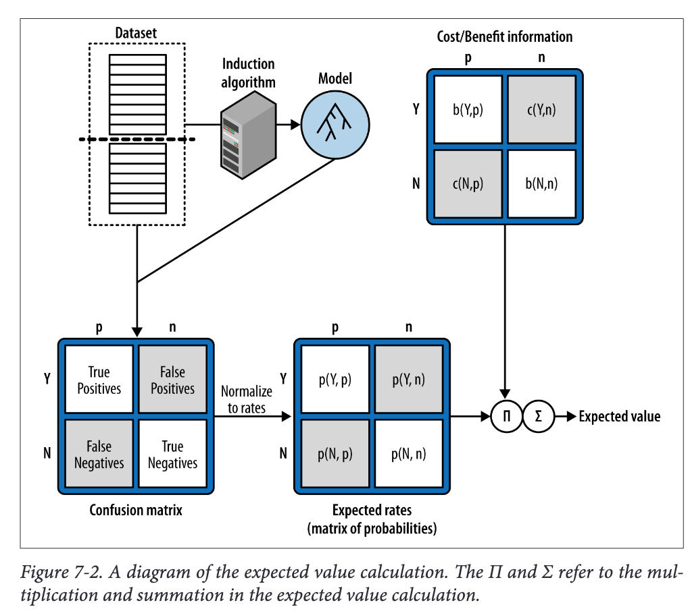

We can use the ***expected value framework*** just described to determine the <mark>best decisions for each particular model</mark>, and then use the <mark>expected value</mark> in a different way to ***compare the models***

Let’s walk through an entire expected profit calculation at the aggregate (model) level, in the process computing these probabilities.

When evaluating a model on testing data, the answer is straightforward: ***these probabilities (of errors and correct decisions)*** can be estimated from the tallies in the confusion matrix by computing the rates of the errors and correct decisions. Each cell of the confusion matrix contains a count of the number of decisions corresponding to the corresponding combination of(predicted, actual), <mark>which we will express as count(h,a) (we use h for “hypothesized” since p is already being used).</mark>

For the expected value calculation we reduce these counts to rates or estimated probabilities, p(h,a). ***We do this by dividing each count by the <mark>total</mark> number of instances***:

Using back the example:

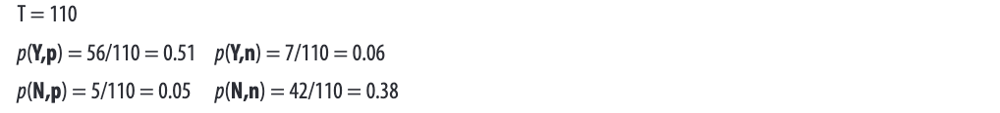

To  compute  expected  profit  (recall  Equation  7-1),  we  also  need  the  cost  and  benefit values that go with each decision pair.These will form the entries of a cost-benefit matrix with the same dimensions (rows and columns) as the confusion matrix.While the probabilities can be estimated from data, the costs and benefits often cannot.
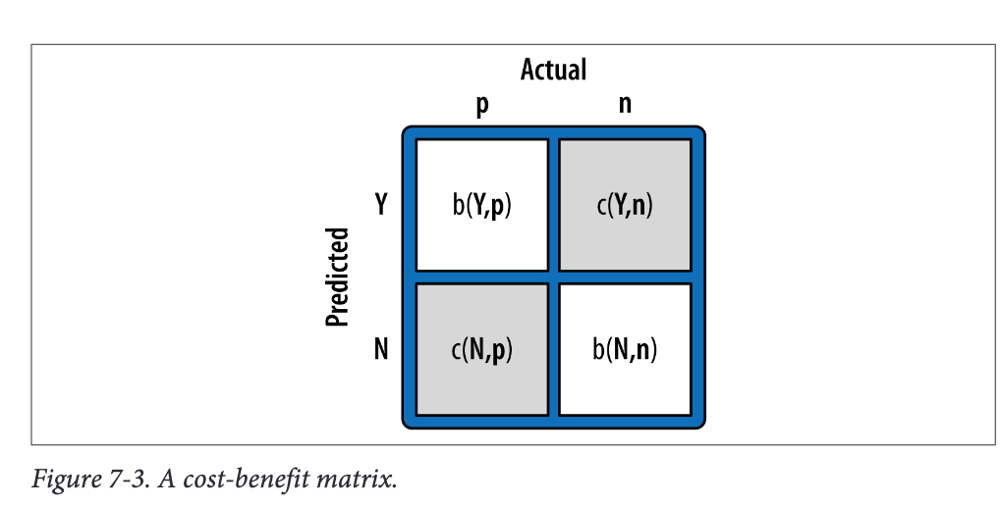
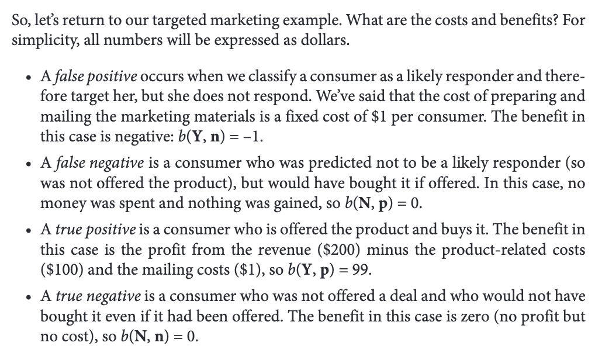
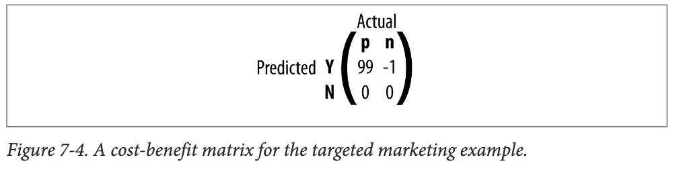
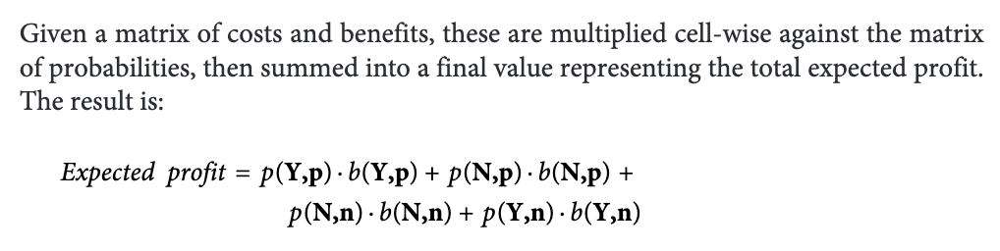

This equation is sufficient for comparing classifiers, but let’s continue along this path a little further, because an ***<mark>alternative calculation</mark> of this equation is often used in practice***

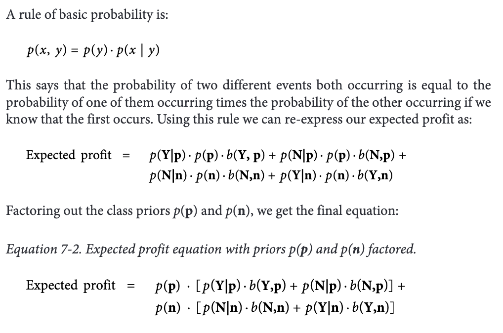

From this mess, notice that we now have ***<mark>one component (the first one) corresponding to the expected profit from the positive</mark>*** examples, and ***<mark>another (the second one) corresponding to the expected profit from the negative examples.</mark>***So, if positive examples are very rare, their contribution to the overall expected profit will be correspondingly small. 

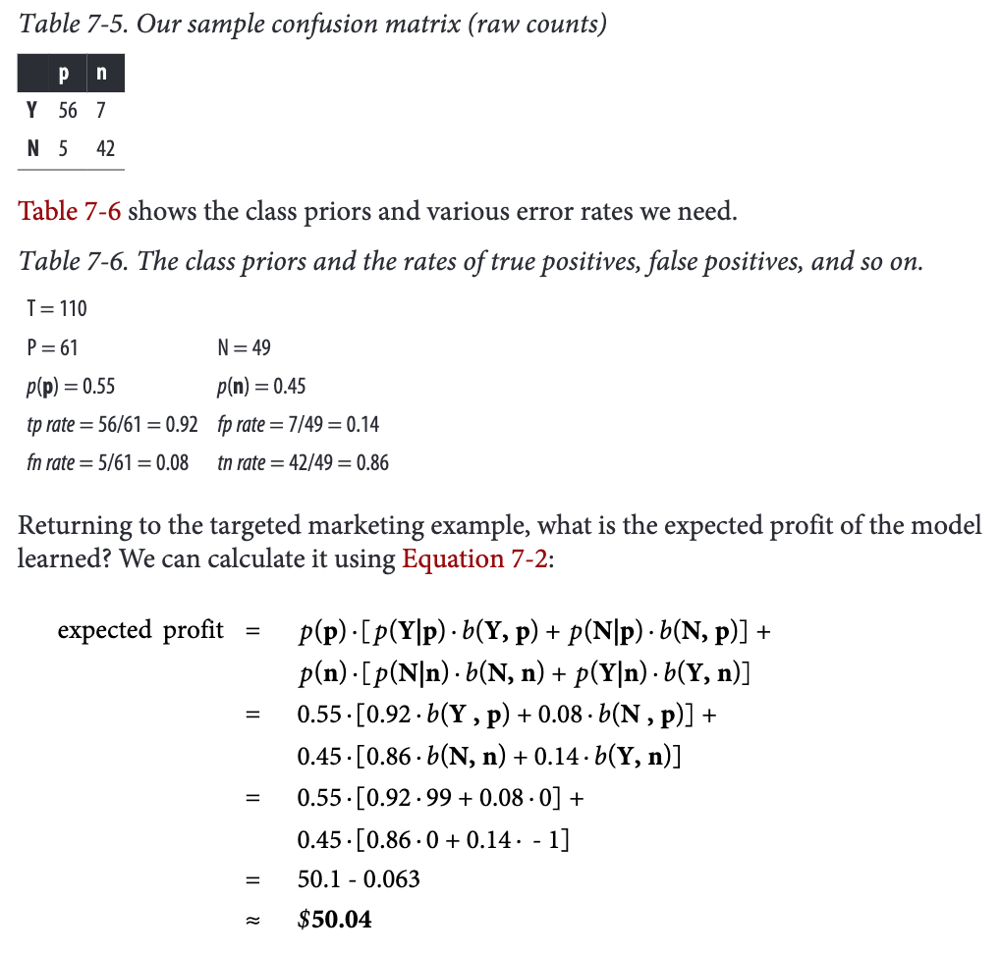

### Evaluation, Baseline Performance, and Implications for Investments in Data

Another fundamental notion indata science is: it is important to consider carefully what would be a ***reasonable baseline*** against which to compare model performance.

The answer of course depends on the actual application, and coming up with suitable baselines is one task for the business understanding phase of the data mining process. Here is some general principles.
1. Importance of Baselines: Understanding what constitutes a reasonable baseline for model performance comparison is crucial for assessing improvements and demonstrating the value added by data analysis to stakeholders.
2. Types of Baselines:
    1. Classification Models: Comparing against a random model can establish the presence of extractable information within the data.
        
        1. Example :Weather Forecasting Analogy: In weather forecasting, baselines include predicting persistence (weather tomorrow is the same as today) and climatology (historical average conditions).

    Majority Classifier: A simple baseline for classification tasks where the model always chooses the majority class of the training dataset.

    Regression Baseline: Predicting the average value over the population (mean or median) serves as a baseline for regression tasks.

3. Guidelines for Good Baselines:
    
    1. Avoid Oversimplification: Be cautious of overly simplistic baselines. For instance, a majority prediction classifier may achieve high accuracy, but that might not be meaningful if the dataset is imbalanced.
    
    2. Consider Desired Outcome: Focus on what is desired from the data mining results rather than solely maximizing prediction accuracy.
    
    3. Single-Feature Models: Exploring models based on a single informative feature or limited feature set can provide insights into baseline performance.

4. Extended Baselines:
    1. Data Source Integration: Compare models built from integrated data sources against those from individual sources to quantify the value of each source.
    
    2. Domain Knowledge Models: Implementing simple models based on domain knowledge or common beliefs can serve as informative baselines for demonstrating the benefits of data mining.
    
    3. Persuasive Baselines: Baselines chosen for comparison should be informative and persuasive to stakeholders, showcasing the added value of data mining efforts beyond simpler strategies.