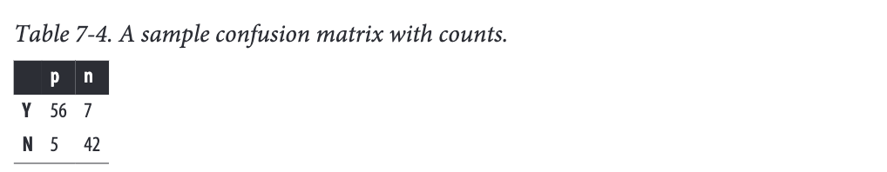
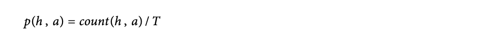

# Week4 
## CHAPTER 7: Decision Analytic Thinking I: What Is a Good Model?

Fundamental concpets: 

1. Careful consideration of what is desired from data science results;
2. Expected value as a key evaluation framework
3. Consideration of appropriate comparative baselines
4. Various evaluation metrics
5. Estimating costs and benefits
6. Calculating expected profit;
7. Creating baseline methods for comparison

We will work through a set of such frameworks and metrics for tasks of classification (in this chapter) and instance scoring (e.g., ordering consumers by their likelihood of responding to an offer), and class probability estimation (in the following chapter).

### Evaluating Classifiers

Let’s consider binary classification, for which the classes often are
simply called “positive” and “negative.” How shall we evaluate how well such a model performs?we should use a holdout test set to assess the generalization performance of the model. But how should we measure generalization performance?

#### Plain Accuracy and Its Problems
The term “classifier accuracy” is sometimes used informally to mean any general measure  of  classifier  performance.  Here  we  will  reserve  accuracy  for  its  specific  technical meaning as the proportion of correct decisions

This is equal to 1–error rate. Accuracy is a common evaluation metric that is often used in data mining studies because it reduces classifier performance to a single number and it  is  very  easy  to  measure.  Unfortunately,  it  is  simplistic  and  has  some  well-known problems.For this we use the confusion matrix

#### Confustion matrix

A confusion matrix for a problem involving n classes is an n × n matrix with the columns labeled with actual classes and the rows labeled with predicted classes. 

We will consider two-class problems, and will denote  the  true  classes  as  p(ositive)  and  n(egative),  and  the  classes  predicted  by  themodel (the “predicted” classes) as Y(es) and N(o), respectively (think: the model says “Yes, it is a positive” or “No, it is not a positive”).

The errors of the classifier are the false positives (negative instances classified as pos‐ itive) and false negatives (positives classified as negative).

### Problems with Unbalanced Classes
As an example of how we need to think carefully about model evaluation, consider a classification problem where one class is rare.
Unfortunately, as the class distribution becomes more skewed, evaluation based on accuracy breaks down.

Chapter 5 mentioned the “base rate” of a class, which corresponds to how well a classifier would  perform  by  simply  choosing  that  class  for  every  instance.With  such  skewed domains the base rate for the majority class could be very high, so a report of 99.9% accuracy may tell us little about what data mining has really accomplished

For example:
 my coworker’s model (call it Model A) achieves 80% accuracy on the balanced sample by correctly identifying all positive examples but only 60% of the negative examples. My model (Model B) does this, conversely, by correctly identifying all the negative examples but only 60% of the positive examples

 

 Classifier A often falsely predicts that customers will churn when they will not, while  classifier  B  makes  opposite  errors  of  predicting  that  customers  will  not  churn when  in  fact  they  will.  When  applied  to  the  original,  unbalanced  population  of  customers, model A’s accuracy declines to 64% while model B’s rises to 96%. This is a huge change. So which model is better?

 

My model (B) now appears to be better than A because B seems to have greater performance on the population we care about—the 1:9 mix of customers we expect to see. But we still can’t say for sure because of another problem with accuracy: we don’t know how much we care about the different errors and correct decisions. It will explain in chapter 8

### Problems with Unequal Costs and Benefits

Another  problem  with  simple  classification  accuracy  as  a  metric  is  that  it  makes  no distinction between false positive and false negative errors.

By counting them together, it makes the tacit assumption that both errors are equally important. With real-world domains this is rarely the case.  These are typically very different kinds of errors with very different costs because the classifications have consequences of differing severity.

Ideally, we should estimate  the  cost  or  benefit  of  each  decision  a  classifier  can  make.  Once  aggregated,these will produce an expected profit (or expected benefit or expected cost) estimate for the classifier

### A Key Analytical Framework: Expected Value
The expected value computation provides a framework that is extremely useful in organizing thinking about data-analytic problems. 

Specifically, it
decomposes data-analytic thinking into 
1. the structure of the problem, 
2. the elements of the analysis that can be extracted from the data
3. the elements of the analysis that need to be acquired from other sources (e.g., business knowledge of subject matter experts)

The expected value is then the weighted average of the values of the different possible outcomes,  where  the  weight  given  to  each  value  is  its  probability  of  occurrence.

Each oi is a possible decision outcome; p(oi) is its probability and v(oi) is its value.

The probabilities often can be estimated from the data (ii),
The business values often need to be acquired from other sources (iii).

#### Using Expected Value to Frame Classifier Use
For targeted  marketing  often  the  probability  of response for any individual consumer is very low—maybe one or two percent—so no consumer may seem like a likely responder. If we choose a “common sense” threshold of 50% for deciding what a likely responder is, we would probably not target anyone.Many  inexperienced  data  miners  are  surprised  when  the  application  of  data  miningmodels results in everybody being classified as not likely responder (or a similar negativeclass).

However, with the expected value framework we can see the crux of the problem.  Let’s walk through a targeted marketing scenario

Consider that we have an offer for a product that, for simplicity, is only available via this offer. If the offer is not made to a consumer, the consumer will not buy the product. We have a model, mined from historical data, that gives an estimated probability of response ( pR (x)) for any consumer whose feature vector description x is given as input.

Expected  value  provides  a  framework  for  carrying  out  the  analysis.  Specifically,  let’s calculate the expected benefit (or cost) of targeting consumer x

where vR is the value we get from a response and vNR is the value we get from no response.Since everyone either responds or does not, our estimate of the probability of not re‐
sponding is just ((1 - pR (x))).The benefits vR and vNR need to be determined separately, as part of the Business Understanding step

To be concrete, let’s say that a consumer buys the product for $200 and our product related costs are $100. To target the consumer with the offer, we also incur a cost. Let’s say that we mail some flashy marketing materials, and the overall cost including postageis $1, yielding a value (profit) of vR = $99 if the consumer responds (buys the product).

Now, what about vNR, the value to us if the consumer does not respond? We still mailed the marketing materials, incurring a cost of $1 or equivalently a benefit of -$1.

#### Using Expected Value to Frame Classifier Evaluation

At  this  point  we  want  to  shift  our  focus  from  ***individual  decisions  to  collections  of decisions.***
Specifically, we need to ***evaluate the set of decisions made by a model*** when applied to a set of examples. Such an evaluation is necessary in order to ***compare one model to another.***.e.g <mark>Does a classification tree work better than a linear discriminant model for a particular problem? </mark>

We can use the ***expected value framework*** just described to determine the <mark>best decisions for each particular model</mark>, and then use the <mark>expected value</mark> in a different way to ***compare the models***

Let’s walk through an entire expected profit calculation at the aggregate (model) level, in the process computing these probabilities.

When evaluating a model on testing data, the answer is straightforward: ***these probabilities (of errors and correct decisions)*** can be estimated from the tallies in the confusion matrix by computing the rates of the errors and correct decisions. Each cell of the confusion matrix contains a count of the number of decisions corresponding to the corresponding combination of(predicted, actual), <mark>which we will express as count(h,a) (we use h for “hypothesized” since p is already being used).</mark>

For the expected value calculation we reduce these counts to rates or estimated probabilities, p(h,a). ***We do this by dividing each count by the <mark>total</mark> number of instances***:

Using back the example:

To  compute  expected  profit  (recall  Equation  7-1),  we  also  need  the  cost  and  benefit values that go with each decision pair.These will form the entries of a cost-benefit matrix with the same dimensions (rows and columns) as the confusion matrix.While the probabilities can be estimated from data, the costs and benefits often cannot.

This equation is sufficient for comparing classifiers, but let’s continue along this path a little further, because an ***<mark>alternative calculation</mark> of this equation is often used in practice***

From this mess, notice that we now have ***<mark>one component (the first one) corresponding to the expected profit from the positive</mark>*** examples, and ***<mark>another (the second one) corresponding to the expected profit from the negative examples.</mark>***So, if positive examples are very rare, their contribution to the overall expected profit will be correspondingly small. 

### Evaluation, Baseline Performance, and Implications for Investments in Data

Another fundamental notion indata science is: it is important to consider carefully what would be a ***reasonable baseline*** against which to compare model performance.

The answer of course depends on the actual application, and coming up with suitable baselines is one task for the business understanding phase of the data mining process. Here is some general principles.
1. Importance of Baselines: Understanding what constitutes a reasonable baseline for model performance comparison is crucial for assessing improvements and demonstrating the value added by data analysis to stakeholders.
2. Types of Baselines:
    1. Classification Models: Comparing against a random model can establish the presence of extractable information within the data.
        
        1. Example :Weather Forecasting Analogy: In weather forecasting, baselines include predicting persistence (weather tomorrow is the same as today) and climatology (historical average conditions).

    Majority Classifier: A simple baseline for classification tasks where the model always chooses the majority class of the training dataset.

    Regression Baseline: Predicting the average value over the population (mean or median) serves as a baseline for regression tasks.

3. Guidelines for Good Baselines:
    
    1. Avoid Oversimplification: Be cautious of overly simplistic baselines. For instance, a majority prediction classifier may achieve high accuracy, but that might not be meaningful if the dataset is imbalanced.
    
    2. Consider Desired Outcome: Focus on what is desired from the data mining results rather than solely maximizing prediction accuracy.
    
    3. Single-Feature Models: Exploring models based on a single informative feature or limited feature set can provide insights into baseline performance.

4. Extended Baselines:
    1. Data Source Integration: Compare models built from integrated data sources against those from individual sources to quantify the value of each source.
    
    2. Domain Knowledge Models: Implementing simple models based on domain knowledge or common beliefs can serve as informative baselines for demonstrating the benefits of data mining.
    
    3. Persuasive Baselines: Baselines chosen for comparison should be informative and persuasive to stakeholders, showcasing the added value of data mining efforts beyond simpler strategies.

## CHAPTER 8: Visualizing Model Performance

1. Visualization of model performance under various kinds of un‐
certainty;
2. Further consideration of what is desired from data mining results
3. Profit  curves
4. Cumulative  response  curves
5. Lift  curves
6. ROC curves

Stakeholders outside of the data science team may have little patience for details, and will often want a higher-level, more intuitive view of model performance. Even data scientists who are comfortable with equations and dry calculations often find such single estimates tobe impoverished and uninformative, because they rely on very stringent assumptions(e.g.,  of  precise  knowledge  of  the  costs  and  benefits,  or  that  the  models’  estimates  ofprobabilities  are  accurate).  In  short,  it  is  often  useful  to  present  visualizations  rather than just calculations, and this chapter presents some useful techniques.

### Ranking Instead of Classifying

Expected Value Framework discussed how the score assigned by a model can be used to compute a decision for each individual case based on its expected value.A different strategy for making decisions is ***to rank a set of cases by these scores***, and then take actions on the cases at the top of the ranked list

It may be that the model gives a score that ranks cases by their likelihood of belonging to  ***the  class  of  interest***,  but  which  is  not  a  true  probability . More importantly, for some reason we may not be able to obtain accurate probability estimates from the classifier.***(e.g. small data size/ target is small in population)***

A common situation is where you have a budget for actions, such as a fixed marketing budget for a campaign, and so you want to target the most promising candidates. If one is  going  to  target  the  highest  expected  value  cases  using  costs  and  benefits  that  are ***constant for each class***, then ranking cases by likelihood of the target class is sufficient.There is no great need to care about the precise probability estimates. The only caveat is that the budget be small enough so that the actions do not go into negative expected value territory. For now, we will leave that as a business understanding task.

When  working  with  a  classifier  that  gives  scores  to  instances,  in  some  situations  the classifier decisions should be very conservative, corresponding to the fact that the classifier should have high certainty before taking the positive action.

This introduces a complication for which we need to extend our analytical framework for assessing and comparing models - The Confusion Matrix 

With  a  ranking  classifier,  a  classifier  plus  a threshold  produces  ***a  single  confusion  matrix***.  Whenever  the  threshold  changes,  the confusion matrix may change as well because the numbers of true positives and false positives change

As  the  threshold  is  lowered,  instances  move  up
from the N row into the Y row of the confusion matrix: an instance that was considered a  negative  is  now  classified  as  positive,  so  the  counts  change.  Which  counts  change depends on the example’s true class. If the instance was a positive (in the “p” column) it moves up and becomes a true positive (Y,p). If it was a negative (n), it becomes a false positive (Y,n). Technically, each different threshold produces a different classifier, represented by its own confusion matrix

This leaves us with two questions: how do we compare different rankings? And, how do we choose a proper threshold? 

If we have accurate probability estimates and a well- specified  cost-benefit  matrix,  then  we  already  answered  the  second  question  in  our discussion of expected value

How about the first question ?

### Profit Curves

Each curve is based on the idea of examining the effect of thresholding the value of a classifier at successive points, implicitly dividing the list of instances into many successive sets of predicted positive and negative instances.

More specifically, with a ranking classifier, we can produce a list of instances and their predicted scores, ranked by decreasing score, and then measure the expected profit that would  result  from  choosing  each  successive  cut-point  in  the  list. 

Conceptually,  this amounts to ranking the list of instances by score from highest to lowest and sweeping down through it, recording the expected profit after each instance. At each cut-point we record the percentage of the list predicted as positive and the corresponding estimated profit. Graphing these values gives us a ***profit curve***.

For this example, let’s assume our profit
margin is small: each offer costs $5 to make and market, and each accepted offer earns $9, for a profit of $4. 

This graph is based on a test set of 1,000 consumers.For each curve, the consumers are ordered from highest to lowest probability of accepting an offer based on some model. 

Notice that all four curves begin and end at the same point.  This should make sense because, at the left side, when no customers are targeted there are no expenses and zero profit; at the right side ***everyone is targeted***, so every classifier performs the same.

In between, we’ll see some differences depending on how the classifiers order the customers. The random classifier performs worst because it has an even chance of choosing a responder or a nonresponder. 

If your goal was simply to maximize profit and you had ***unlimited resources***, you should choose Classifier 2, use it to score your population of customers, and target the top half (highest 50%) of customers on the list.

Now consider a slightly different but very common situation where you’re constrained by a budget.As before, you still want to target the highest-ranked people, but now you have a budgetary constraint that may affect your strategy. 

For example : you only have $40,000 
What do you do in this case? Well, first you figure out how many offers you can afford to make. Each offer costs $5 so you can target at most $40,000/$5 = 8,000 cus‐tomers. 

Which  model  should  you  use  for  this  campaign? 8,000 customers is 8% of your total customer base, so check the performance curves at x=8%. The best-performing model at this performance point is Classifier 1

Profit curves are appropriate when you know fairly certainly the conditions under which
a  classifier  will  be  used.  Specifically,  there  are  two  critical  conditions  underlying  the
profit calculation:
1. The  class  priors;  that  is,  the  proportion  of  positive  and  negative  instances  in  the
target population, also known as the base rate (usually referring to the proportion
of positives). Recall that Equation 7-2 is sensitive to p(p) and p(n).
2. The costs and benefits. The expected profit is specifically sensitive to the relative levels of costs and benefits for the different cells of the cost-benefit matrix

If both class priors and cost-benefit estimates are known and are expected to be stable, profit curves may be a good choice for visualizing model performance.

### ROC Graphs and Curves

For sometime we do not know class  priors and The costs and benefits

One approach to handling uncertain conditions is to generate many different expected profit calculations for each model. his may not be very satisfactory: the sets of models, sets of class priors, and sets of decision costs multiply in complexity. This often leaves the analyst with a large stack of profit graphs that are difficult to manage, difficult to understand the implications of, and difficult to explain to a stakeholde

Another approach is to use a method that can accomodate uncertainty by showing the entire space of performance possibilities. One such method is the Receiver Operating Characteristics (ROC) graph 

A ROC graph is a two-dimensional plot of a classifier with false positive rate on the x axis against true positive rate on the y axis.As such, a ROC graph depicts relative trade-offs that a classifier makes between benefits (true positives) and costs (false positives)

A discrete classifier is one that outputs only a class label (as opposed to a ranking). Note that although the confusion matrix contains four numbers, we really only need two of the rates: either the true positive rate or the false negative rate, and either the false positive rate or the true negative rate.  Given one from either pair the other can be derived since they sum to one. It is conventional to use the true positive rate (tp rate) and the false positive rate (fp rate), and we will keep to that convention so the ROC graph will make sense. Each discrete classifier produces an (fp rate, tp rate) pair corresponding to a single point in ROC space. 

Several points in ROC space are important to note. 

1. The lower left point (0, 0) represents the strategy of never issuing a positive classification; such a classifier commits no false positive errors but also gains no true positives. 

2. The opposite strategy, of unconditionally issuing positive classifications, is represented by the upper right point (1, 1)

3. The point (0, 1) represents perfect classification, represented by a star.

4.  The diagonal line connect‐ ing (0, 0) to (1, 1) represents the policy of guessing a class. 

5. if a classifier randomly  guesses  the  positive  class  half  the  time,  it  can  be  expected  to  get  half  the positives and half the negatives correct;this yields the point (0.5, 0.5) in ROC space.  If it guesses the positive class 90% of the time, it can be expected to get 90% of the positives correct but its false positive rate will increase to 90% as well, yielding (0.9, 0.9) in ROC space. 

6. One point in ROC space is superior to another if it is to the northwest of the first (tp rate is higher and fp rate is no worse; fp rate is lower and tp rate is no worse, or both are better).

7. Classifiers appearing on the lefthand side of a ROC graph, near the x axis, may be thought of as “conservative”: they raise alarms (make positive classifications) only with strong evidence so they make few false positive errors, but they often have low true positive rates as well

8. Classifiers on the upper righthand side of a ROC graph may be hought of as “permissive”: they make positive classifications with weak evidence so they classify  nearly  all  positives  correctly,  but  they  often  have high  false  positive  rates.

so **A** is more conservative than **B**, which in turn is more conservative than **C**

Whenever we pass a positive instance, we take a step upward (increasing true positives);whenever we pass a negative instance, we take a step rightward (increasing false posi‐ tives). Thus the “curve” is actually a step function for a single test set, but with enough instances it appears smooth

An  advantage  of  ROC  graphs  is  that  they  decouple  classifier  performance  from  the conditions under which the classifiers will be used. Specifically, they are independent of the class proportions as well as the costs and benefits

#### The Area Under the ROC Curve (AUC)

An important summary statistic is the area under the ROC curve (AUC). As the name implies, this is simply the area under a classifier’s curve expressed as a fraction of the unit  square.  Its  value  ranges  from  zero  to  one.  Though  a  ROC  curve  provides  more information than its area, <mark>the AUC is useful when a single number is needed to summarize performance, or when nothing is known about the operating conditions. </mark>

### Cumulative Response and Lift Curves

ROC curves are not the most intuitive visualization for many business stakeholders who really ought to understand the results.

An alternate visualization is the use of the <mark>“cumulative response curve,”</mark> rather than the ROC curve. They are closely related,

Cumulative response curves plot the hit rate (tp rate; y axis), i.e., the percentage of positives correctly classified, as a function of the percentage of the population that is targeted (x axis) As with ROC curves, the diagonal line x=y represents random performance

Intuitively,  the  lift  of  a  classifier  represents  the  advantage  it  provides  over  random guessing.

The lift is the degree to which it “pushes up” the positive instances in a list above the negative instances. 

For example, consider a list of 100 customers, half of whom
churn (positive instances) and half who do not (negative instances). If you scan down the  list  and  stop  halfway  (representing  0.5  targeted),  how  many  positives  would  you expect to have seen in the first half ? If the list were sorted randomly, you would expect to have seen only half the positives (0.5), giving a lift of 0.5/0.5 = 1.If the list had been ordered by an effective ranking classifier, more than half the positives should appear in the top half of the list, producing a lift greater than 1. If the classifier were perfect, all positives would be ranked at the top of the list so by the midway point we would have
seen all of them (1.0), giving a lift of 1.0/0.5 = 2.

### Example:

There are about 47,000 instances altogether, of which about  7%  are  marked  as  churn  (positive  examples)  and  the  remaining  93%  are  not (negatives).

Let’s begin with a very naive evaluation. We’ll train on the complete dataset and then test on the same dataset we trained on. We’ll also measure simple classification accuracies. 

1. there appears to be a wide range of performance —from 76% to 100%
2. Also, since the dataset has a base rate of 93%, any classifier should be able to achieve at least this minimum accuracy. 
    1.  This makes the Naive Bayes result look strange since it’s significantly worse.

    2. Also, at 100% accuracy, the k-Nearest Neighbor classifier looks suspiciously good

***But this test was performed on the training set***They are more
likely to be an indication of how well each classifier can memorize (overfit) the training set than anything else. 

we could just split the dataset in half, but instead we’ll use the cross-validation procedure.This will not only ensure proper separation of datasets but also provide a measure of variation in results. New result is belowed

Each number is an average of ten-fold cross validation followed by a “±” sign and the standard deviation of the measurements.

The accuracy numbers have all dropped considerably, except for Naive Bayes, which is still oddly low. The standard deviations are fairly small compared to the means so there is not a great deal of variation in the performance on the folds. This is good.

At the far right is a second value, the Area Under the ROC Curve (commonly abbreviated AUC).A value of 0.5 corresponds to randomness (the classifier cannot distinguish at all between positives and negatives) and a value of one means that it is perfect in distinguishing them.

One of the reasons accuracy is a poor metric is that it is misleading when datasets are skewed, which this one is (93% negatives and 7% positives)

So that to confirm the overfitting, we look at the fitting curve

The “sweet spot” where holdout performance is maximum is at about 100 tree nodes, beyond which the performance on the holdout data declines.

so we can conclude the model is overfit or not. Assume everything is no overfit and in sweet pot 

There are two things to note about the AUC values. 

One is that they are all fairly modest.This is unsurprising with real-world domains: many datasets simply have little signal to be exploited, or the data science problem is formu‐ lated after the easier problems have already been solved.Even modest AUC scores may lead to good business results

The second interesting point is that Naive Bayes, which has the lowest accuracy of the group, has the highest AUC score

Let’s take a look at a sample confusion matrix of Naive Bayes, with the highest AUC and lowest accuracy, and compare it with the confusion matrix of k-NN (lowest AUC and high accuracy) on the same dataset.

Here is the Naive Bayes confusion matrix

Here is the K-Nearest Neighbors confusion matrix on the same test data:

We see from the k-NN matrix that it rarely predicts churn—the Y row is almost empty. In other words, it is performing very much like a base-rate classifier, with a total accuracy of just about 93%.

On the other hand, the Naive Bayes classifier makes more mistakes
(so its accuracy is lower) but it identifies many more of the churners. 

Note that the curves corresponding to Naive Bayes (NB) and Classification Tree (Tree) are somewhat more “bowed” than the others, indicating their predictive superiority.

As we said, ROC curves have a number of nice technical properties but they can be hard to read. The degree of “bowing” and the relative superiority of one curve to another can be  difficult  to  judge  by  eye.  Lift  and  profit  curves  are sometimes  preferable,  

Both Tree (Classification  tree)  and  NB  (Naive  Bayes)  perform  very  well.  Tree  is  superior  up through about the first 25% of the instances, after which it is dominated by NB. Both k-NN and Logistic Regression (LR) perform poorly here and have no regions of superiority. Looking at this graph, if you wanted to target the top 25% or less of customers, you’d choose the classification tree model; if you wanted to go further down the list you should choose NB. Lift curves are sensitive to the class proportions, so if the ratio of churners to nonchurners changed these curves would change also

Although the lift curve shows you the relative advantage of each model, it does not tell you how much profit you should expect to make—or even whether you’d make a profit at all.

For that purpose we use a profit curve, which incorporates assumptions about costs and benefits and displays expected value

Let’s assume an expense of $3 for each offer and a gross benefit of $30, so a true positive gives us a net profit of $27 and a false positive gives a net loss of $3. This is a 9-to-1 profit ratio. 

The case 1 resulting profit curves are shown

The classification tree is superior for the highest cutoff thresholds, and Naive Bayes dominates for the remainder of the possible cutoff thresholds. Maximum profit would be achieved in this scenario by targeting roughly the first 20% of the population

In the second scenario, we assume the same expense of $3 for each offer (so the false positive cost doesn’t change) but we assume a higher gross benefit ($39), so a true positive now nets us a profit of $36. This is a 12-to-1 profit ratio. 

The case 2 resulting profit curves are shown

One peak is with the Classification Tree at about 20% of the population and the second peak,slightly  higher,  occurs  when  we  target  the  top  35%  of  the  population  with  NB.  The crossover point between Tree and LR occurs at the same place on both graphs, however: at about 25% of the population. This illustrates the sensitivity of profit graphs to the particular assumptions about costs and benefits.