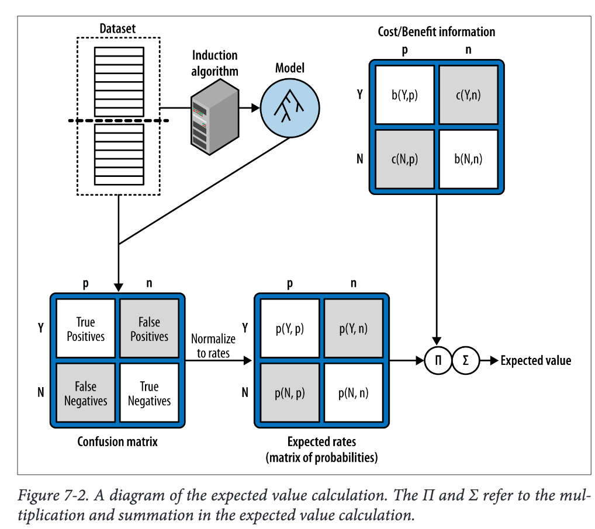
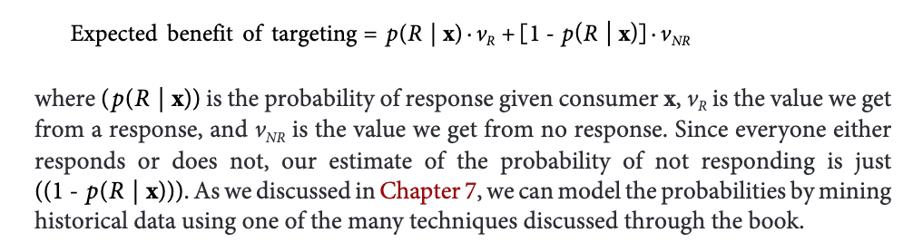
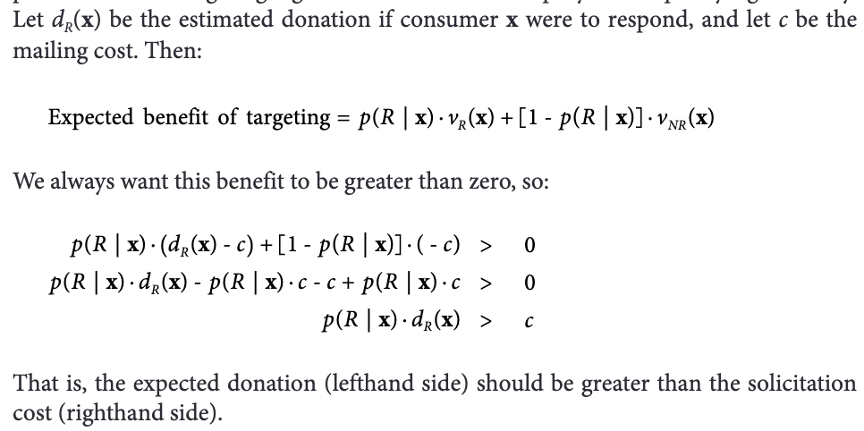
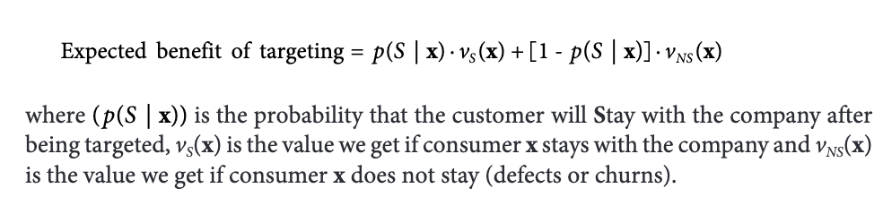
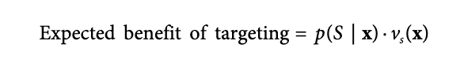
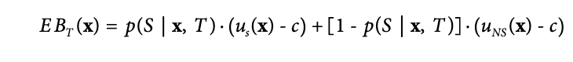
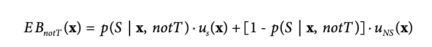
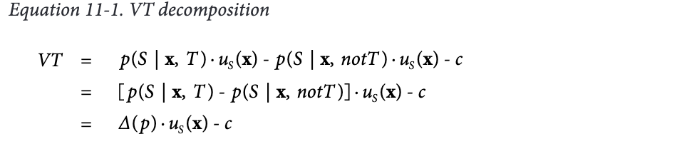

# Week4 
## CHAPTER 11: Decision Analytic Thinking II: Toward Analytical Engineering 

Fundamental concept:
1. Solving business problems with data science starts with analytical engineering:  designing  an  analytical  solution, based  on  the  data,  tools,  and  techniques available.
2.  Expected value as a framework for data science solution design

In this chapter, we will illustrate such analytical engineering with two case studies. In these case studies, we will see the application of the fundamental principles presented pass weeks

One  common  theme  that  runs  through  these  case  studies  is  how  our  expected  value framework  helps to decompose each of the business problems into subproblems, such that the subproblems can be attacked with tried-and-true data science techniques

### Charity Mailing example

Targeted marketing makes for a perfect case study for two reasons.

1. a  very  large  number  of  businesses  have  problems  that  look  similar  to  targeted marketing  problems—traditional  targeted  (database)  marketing,  customer-specific coupon offers, online ad targeting, and so on. 

2. the fundamental structure of the problem occurs in many other problems as well, such as our running example problem of churn management

Fundraising organizations (including those in universities) need to manage their budgets and the patience of their potential donors. In any given campaign segment, they would like to solicit from a “good” subset of the donors. This could be a very large subset for an inexpensive, infrequent campaign, or a smaller subset for a focused campaign that includes a not-so-inexpensive incentive package

#### The Expected Value Framework: <Mark>Decomposing</mark> the business problem and recomposing the solution pieces

we want to model the probability that each prospective customer, a prospective donor in this case, will respond to the offer. 

However, thinking carefully about the business problem we realize that in this case, the response can vary—some people might donate $100 while others might donate $1. We need to take this into account.we would like to maximize our donation profit—meaning the net after taking into account the costs.

we can use expected value as a framework for structuring our approach to engineering a solution to the problem.

In this case, the
value varies from consumer to consumer, and we do not know the value of the donation that any particular consumer will give until after she is targeted! 

where vR(x) is the value we get from a response from consumer x and vNR(x) is the value we get if consumer x does not respond. The value of a response, vR(x), would be the consumer’s donation minus the cost of the solicitation. The value of no response, vNR(x), in this application would be zero minus the cost of the solicitation. 

To be complete, ***we also want to estimate the benefit of <mark>not targeting<mark>***, and then ***<mark>compare<mark>*** the two to make the decision of whether to target or not. 

The expected benefit of not targeting is simply zero—in this application, we do not expect consumers to donate spontaneously without a solicitation. That may not always be the case, but let’s assume it is here.

### A Brief Digression on Selection Bias

For modeling  the  predicted  donation,  notice  that  the  data  may  well  be  biased—meaning that they are not a random sample from the population of all donors. 

Because the data are from past donations—from the individuals who did respond in the past. This is similar to the idea of modeling creditworthiness based on the experience with past credit customers: those are likely the people whom you had deemed to be creditworthy in the past!

This is an example of <mark>selection bias</mark>—the data were not selected randomly from the population to which you intend to apply the model, but instead were biased in some way

### Example 2 : Churn rate again

Let’s keep our basic example  problem  setting:  we’re  having  a  serious  problem  with  churn  in  our  wireless business. Marketing has designed a special retention offer. Our task is to target the offer to some appropriate subset of our customer base

Initially, we had decided that we would try to use our data to determine which customers would be the most likely to defect shortly after their contracts expire.Let’s continue to focus on the set of customers whose contracts are about to expire, because this is where most of the churn occurs.

However, do we really want to target our offer to those with the highest probability of defection?

Why is churn a problem? Because it causes us to lose money. The real
business problem is losing money. If a customer actually were costly to us rather than profitable, we may not mind losing her. We would like to limit the amount of money we are losing—not simply to keep the most customers

In the case of churn,  the  value  of  an  individual  may  be  much  easier  to  estimate:  these  are  our  customers, and since we have their billing records we can probably forecast their future value pretty well

To see this let’s oversimplify by assuming that the value if the customer does not stay is zero. Then our expected value becomes:

That does not jibe with our prior intuition that we want to target those who have the highest probability of leaving. What’s wrong?  We cannot apply what we did in donation problem. The main difference is We want to target those where we would lose the most value if they were to leave.

#### Assessing the Influence of the Incentive

Let’s dig even deeper, calculating both the benefit of targeting a customer with the incentive and of not targeting her, and making the cost of the incentive explicit. 

Let’s call:

uS(x): the profit from customer x if she stays, not including the incentive cost; 

uNS(x):the profit from customer x if she leaves, not including the incentive cost

c: the  incentive  cost  c 

So let’s compute separately the expected benefit if we target or if we do not target.which we indicate by conditioning the probability of staying on
the two possibilities (target, T, or not target, notT)

The expected benefit of targeting is:

The expected benefit of not targeting is:

These are specifically those customers where EBT(x) – EBnotT(x) is the largest. 

Consider the conditions under which this “value of targeting,” 

VT = EBT(x) – EBnotT(x)

would be the largest. 

Let’s expand the equation for VT, but at the same time simplify by assuming that we get ***no value*** from a customer if she does not stay

where (Δ( p)) is the difference in the predicted probabilities of staying, depending on whether the customer is targeted or not. 

