# Week6  
## CHAPTER 9: Evidence and Probabilities

Fundamental Concepts: 

1. Explicit  evidence  combination  with  Bayes’  Rule
2. Probabilistic reasoning via assumptions of conditional independence
3. Naive Bayes classification; 
4. Evidence lift

Let’s now examine a different way of looking at drawing such conclusions.
We could think about the things that we know about ***a data instance as evidence*** for or against different values for the target.

If we knew the strength of the evidence given by each
feature, we could apply principled methods for combining evidence probabilistically to reach a conclusion as to the value for the target. 

### Example: Targeting Online Consumers with advertisements
Targeting online display advertisements to consumers, based on what webpages they have visited in the past. 

Inferring the value of an instance’s target variable from the values of the instance’s features. Therefore, we could apply the techniques we already have covered to infer whether a particular user would be interested in an advertisement. 
In this chapter we introduce <mark>a different way</mark> of looking at the problem that has wide applicability and is quite easy to apply.

Let’s define our ad targeting problem more precisely. What will be an instance? What will be the target variable? What will be the features? How will we get the training data?

For simplicity, assume we have one advertising campaign for which we would like to target some subset of the online consumers that visit our sites. 

This campaign is for the upscale hotel chain, Luxhote. The goal of Luxhote is ***for people to book rooms.***

We have run this campaign in the past, selecting online consumers randomly.We now want to run a targeted campaign, hopefully getting more bookings per dollar spent on ad impressions

For  training,  we  will  have  a binary  value  for  this  target  variable  for  each  consumer.  In  use,  we  will  estimate  the probability that a consumer will book a room after having seen an ad, and then, as our budget allows, target some subset of the highest probability consumers

We  are  left  with  a  key  question:  
what  will  be  the  ***features***  we  will  use  to  describe  the consumers, such that we might be able to differentiate those that are more or less likely to be good customers for Luxhote? 

we will consider a consumer to be described  by  the  set  of  content  pieces  that  we  have  observed  her  to  have  viewed  (or Liked) previously, again as recorded via browser cookies or some other mechanism

However,  for  this  exercise  we  do  not  want  to  rely  on  our  ***presumptions***  about  such content, nor do we have the resources to estimate the evidence potential for each content piece manually.

We would like our historical data to estimate both the direction and the strength of the evidence. We need a framework  both for evaluating the evidence, and for combining it to estimate the resulting likelihood of class membership

### Combining Evidence Probabilistically

We are interested in quantities such as the probability of a consumer booking a room after being shown an ad

Let’s start with just any consumer: what is the probability that if you show an ad to just any consumer, she will book a room? 

As this is our desired classification, let’s call this quantity C.
We will represent the probability of an event C as p(C).

Now, we are interested in the probability of C given some evidence E, such as the set of websites visited by a particular consumer. 

We will represent the probability of C given E ( “the probability of C conditioned on E.”) as p(C|E)

As mentioned above, <mark>we would like to use some labeled data, such as the data from our randomly targeted campaign, to associate different collections of evidence E with different probabilities.</mark>

#### Joint Probability and Independence

Joint probability.

Let’s say we have two events, A and B. If we know p(A) and p(B), can we say what is the probability that both A and B occur? Let’s call that p(AB). Under Events A and B are independent.\
we can calculate the probability of the “joint” event AB by multiplying the probabilities of the individual events.

    p(AB) = p(A) · p(B)

For some Dependent event 

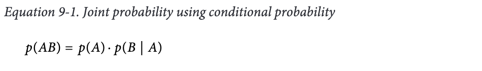

This is read as: the probability of A and B is the probability of A times the probability of B given A. 

So how to get the probility of B 

##### Bayes’ Rule
if p(AB) = p(A)p(B|A) the order of A and B is not important

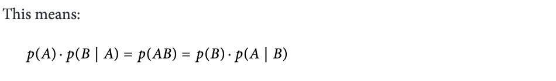
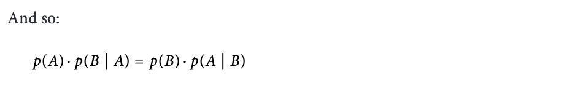
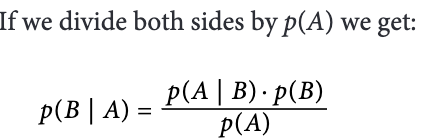

Renaming  with  H  for hypothesis and E for evidence, we get:

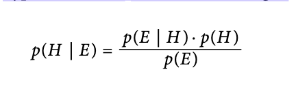

Bayes’ Rule says that we can compute the  probability  of  our  hypothesis  H  given  some  evidence  E  ***by  instead  looking  at  the probability of the evidence given the hypothesis***,

- p(E|H) is ***the probability that one has red spots given that one has measles***. An expert in infectious diseases may well know this or be able to estimate it relatively accurately

- p(H) is simply the probability that ***someone has measles, without considering any evidence***; that’s just the prevalence of measles in the population.

- p(E) is the ***probability of the evidence: what’s the probability that someone has red spots—again,*** simply the prevalence of red spots in the population, which does not require  complicated  reasoning  about  the  different  underlying  causes,  just  observation and counting

##### Applying Bayes’ Rule to Data Science
how they apply in the most basic of Bayesian techniques—which is used a great
deal. Let’s rewrite Bayes’ Rule yet again, but now returning to classification.

Let’s for the
moment emphasize the application to classification by writing out "C = c“ — the event that the target variable takes on the ***particular value c.***

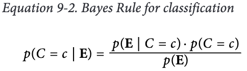

On the lefthand side is the quantity we would like to estimate

    the probability that the target variable C takes on the class of interest c after taking the evidence E (the vector of feature values) into account. (posterior probability.)

the posterior probability into the three quantities that we see on the righthand side.

1. p(C = c) is the “prior” probability of the class, i.e., the probability we would assign to the class before seeing any evidence. (do not dependent on E). It could come from .
    1. a “subjective” prior, meaning that it is the belief of a particular decision maker based on all her knowledge, experience, and opinions; 
    2. a “prior” belief based on some previous application(s) of Bayes’ Rule with other evidence,
    3. ***an unconditional probability inferred from data***
2. p(E |C = c) is the likelihood of seeing the evidence E—the particular features of the example being classified—when the class C = c. ***It calculated from the data as the percentage of examples of class c that have feature vector E***

3. p(E) is the likelihood of the evidence: how common is the feature repre‐
sentation  E  among  all  examples?*** It  calculated from he  data  as  the
percentage occurrence of E among all examples***

In short :  <mark>***Estimating these three values from training data***</mark>

##### Conditional Independence and Naive Bayes

Recall from above the notion of independence: two events are independent if knowing one  does  not  give  you  information  on  the  probability  of  the  other.

Conditional independence is the same notion, except using conditional probabilities

Conditional independence is directly analogous to the unconditional independence we discussed above

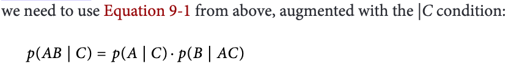

    P(AB|C) = P(AB)/p(C) ## by defination of independence conditional prob.
            = P(A)/p(C)*P(B|A)/P(C) # equation 9-1
            = P(A|C) * (P(B)/P(A)) / P(C) ## again by defination
            = P(A|C) * (P(B)/(P(A)*P(C)) 
            = P(A|C) * (P(B)/P(AC))
            = P(A|C) * P(B|AC)         ## again by defination     

It is not use but if we assume that A and B are conditionally independent given C,

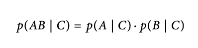

This makes a huge difference in our ability to compute the probabilities from the data. 

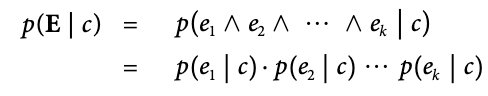

in p(e1∧e2∧⋯∧ek|c), each ei is independent of every other ej given the class c

Each of the p(ei | c) terms can be computed directly from the data, since now ***we simply need  to  <mark>count  up</mark>  the  proportion  of  the  time  that  we  see  individual  feature  ei  in  the instances of class c***, rather than looking for an entire matching feature vector. 

Combined with 

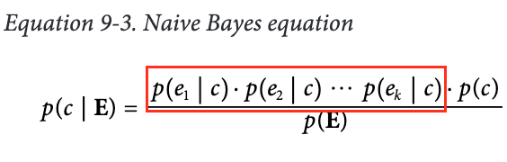

at this point you might notice the p(E) in the denominator of Equation 9-3 and say, and P(E) is not hard to calcuated sincethe classes often are mutually exclusive and exhaustive, meaning that every instance will belong to one and only one class

In our Luxhote example, a consumer either books a room or does not. Informally, if we see evidence E it belongs either to c0 or c1. Mathematically

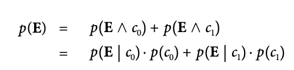

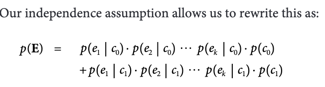

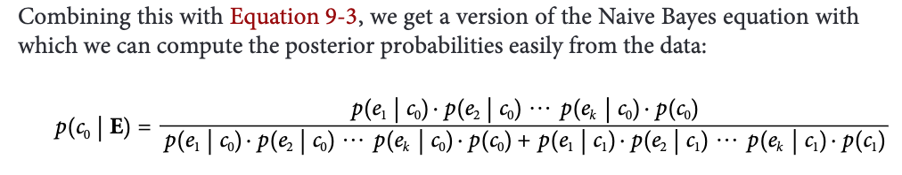

##### Advantages and Disadvantages of Naive Bayes

Advantages of Naive Bayes

1. Simplicity and Efficiency:
    - Easy to implement and understand.
    - Requires less computational resources and storage space.
2. Fast Training and Classification:
    - Training is quick as it only involves counting the occurrences of features and classes.
    - Classification is also rapid, making it suitable for real-time applications.
3. Works Well with Large Datasets:
    - Performs effectively even with large amounts of data.
4. Good Performance with Independence Assumption Violation:
    - Surprisingly effective even when the independence assumption is violated.
    - Tends to produce reasonable results in practice, especially for text classification.
5. Incremental Learning:
- Can update the model one instance at a time, making it suitable for applications where new data arrives continuously.

6. Baseline Classifier:
    - Commonly used as a baseline for comparing more complex algorithms.

7. Handles Multi-Valued and Numeric Attributes:
    - Can be easily extended to handle categorical features with multiple values and numeric attributes.

Disadvantages of Naive Bayes
1. Independence Assumption:
    - Assumes that features are independent given the class, which is often not true in real-world scenarios.
2. Zero Probability Problem:
    - If a particular feature/class combination is not present in the training data, it can lead to zero probabilities, which can be problematic. This is often mitigated using techniques like Laplace smoothing.
3. Limited Expressiveness:
    - May not capture complex relationships between features due to its simplistic nature.
4. Not Suitable for All Data Types:
    - Less effective for continuous data unless assumptions about the distribution (e.g., Gaussian) are made.
5. Probability Estimates:
    - While it performs well for classification, the probability estimates can be unreliable for decision-making processes.
6.  Requires Sufficient Training Data:
    - Performance may degrade if there is insufficient training data for certain classes or features.

### A Model of Evidence “Lift”

 the notion of lift as a
metric for evaluating a classifier. Lift measures how much more prevalent the positive
class is in the selected subpopulation over the prevalence in the population as a whole

If the prevalence of hotel bookings in a randomly targeted set of consumers is 0.01% and in our selected population it is 0.02%, then the classifier gives us a lift of 2—the selected population has double the booking rate

With a slight modification, we can adapt our Naive Bayes equation to model the different lifts attributable to the different pieces of evidence.

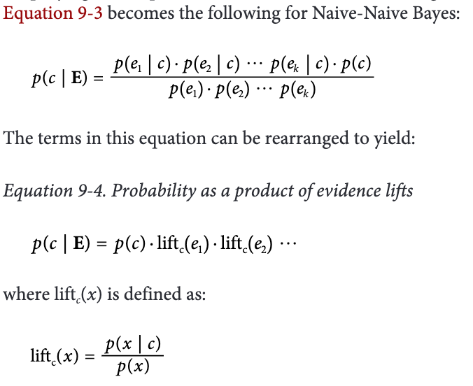

Consider how these evidence lifts will apply to a new example E =<e1, e2, ⋯, ek>

so p(c|E) = p(c)*liftc(***E***)