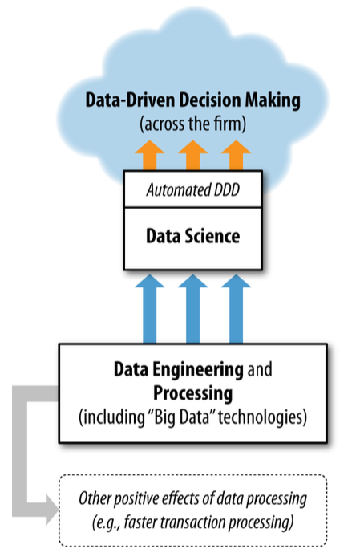
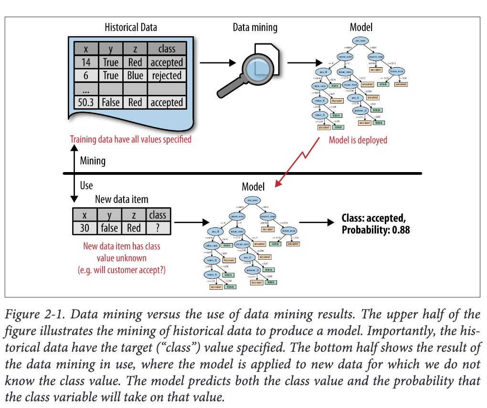
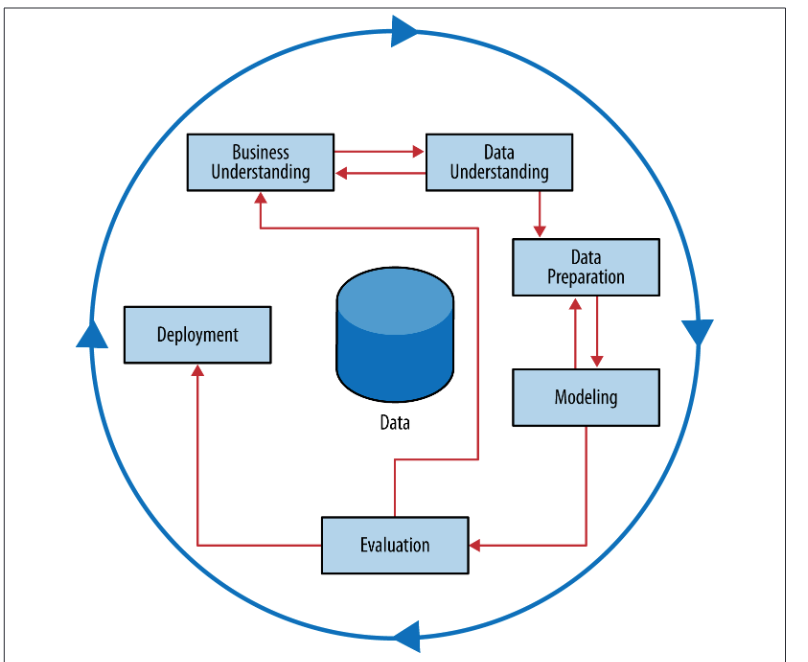

# Week1

## Chapter1: Introduction: Data-Analytic Thinking 

### Data Science, Engineering, and Data-Driven Decision Making 

Data Science involve principles, processes and techniques for understanding phenonone via the analysis data.

The ultimate goal of data science as improving decision making, as this generally is of direct interest to business

***Data-driven decision-making(DDD)*** refers to the practice of basing decisions on the analysis of data, rather than purely on intuition

Typically, we have 2 types of decisions is making on DDD

1.  Decisions for which "discoveries" need to be made within data
e.g. What Walmart need to prepare for Hurricane Frances's imminent arrival

2. Decisions that repeat, especially at massive scale, and so decision-making can benefit from even small increases in decision-making accuracy based on data analysis.
e.g. MegaTelCo's know to lower the Chum rate by giving benefits (a free months)

### Data Processing and "Big Data"

Data processing $\neq$ data science

|Data Science | Data Processing| Big Data |
|---|---|---|
| Data science needs access todata and it often benefits from sophisticated data engineering that data processingtechnologies may facilitate, but these technologies are not data science technologies per se.   |  Data processing technologies are very important for many data-oriented business tasksthat do not involve extracting knowledge or data-driven decision-making, such as efficient transaction processing, modern web system processing, and online advertisingcampaign management. |Big data essentially means datasets that are too largefor traditional data processing systems, and therefore require new processing technologies. |

### From Big Data 1.0 to Big data 2.0

|Big Data 1.0| Big Data 2.0|
|---|---|
|Firms are busyingthemselves with building the capabilities to process large data, largely in support of theircurrent operations—for example, to improve efficiency.|Once firms have become capable of processing massive data in a flexible fashion, they should begin asking: “What can I now do that I couldn’t do before, or do better than I could do before?” |

### Data and Data Science Capability as a Strategic Asset 

one of the fundamental principles of data science: 
- data, and the capability to extract useful knowledge from data, should be regarded as key strategic assets.It need talent and correct data to be come a great assets.

### Data-Analytic Thinking

When faced with a business problem, you should be able to assess whether and
how data can improve performance. 

There is a frameworks to structure the analysis so that it can be done systematically 

### Data Mining and Data Science, Revisited

4 fundamental concepts on Data ming and data science` 

Extracting useful knowledge from data to solve business problems can be treated systematically by following a process with reasonably well-defined stages.

From a large mass of data, information technology can be used to
find informative descriptive attributes of entities of interest.

If you look too hard at a set of data, you will find something—but it might not generalize beyond the data you’re looking at.(Overfiting)

Formulating data mining solutions and evaluating the resultsinvolves thinking carefully about the context in which they will be used.

---

## Chapter 2: Business Problems and Data Science Solutions
Fundamental concepts:
- ***A set of canonical data mining task***
- ***The data mining process***
- ***Supervised versus unsupervised data mining***

Since the data mining process breaks up the overall task of finding patterns from data into a set of well-defined subtasks, it is also useful for structuring discussions about datascience.

### From business problems to data mining tasks
Each Data-driven business decision-making problem is unique, but there are sets of common tasks that underlie the business problems

The  solutions  to  the  subtasks  can  then  be  composed  to  solve  the
overall problem.Some of these subtasks are ***unique to the particular business problem***, but others are ***common data mining tasks.***

Taking churn prob. as example, the subtask would be :
-  estimate from historical
data the probability of a customer terminating her contract shortly after it has expired.

This probability estimation fits the mold/template(模) of one very common data mining task 

There are several type of algo but we focus on first two (classification and regression)

An "individual" will refer to an entity about which we have data,  such\ as a customer or a consumer, or it could be an inanimate entity such as a business. 

At the end of date, correlations” between a particular variable describing an individual and other variables.

Some Correlations type:

#### Classification and class probability estimation
Target:
    
    it attempt to predict,  for each individual in a population, which of a (small) set of classes this individual belongs to.Usually the  classes  are  ***mutually  exclusive***. such as give who an offer
Task:

    For a classification task, a data mining procedure produces a model that, given ***a new individual***, determines which class that individual belongs to. 
    A scoring model applied to an indi‐vidual produces, instead of a class prediction, a score representing the probability(or  some  other  quantification  of  likelihood)  that  that  individual  belongs  to  each class

#### Regression(value estimation)

Target:

    It attempts to estimate or predict, for each individual,
    the  numerical  value  of  some  variable  for  that  individual.

Tasks:

    Aregression  procedure  produces  a  model  that,  given  an  individual,  estimates  the value of the particular variable specific to that individual.     

***note*** 
Regression is related to classification, but the two are different. Informally, classification predicts whether something will happen, whereas regression predicts ***how much  something  will  happen.***

#### Similarity matching

Target:

    It attempts to identify similar individuals based on data known about them. it can be used directly to find similar entities.Similarity matching is the basis for one of the most popular methods for making product recommendations 

Tasks

    Similarity measures un‐derlie certain solutions to other data mining tasks, such as classification, regression,and clustering. 

#### Clustering

Target:

    It attempts to group individuals in a population together by their similarity, but not driven by any specific purpose.
    it uses to answer the questions like “Do our customers form natural groups or segments?” 

    Clustering is useful in pre‐liminary domain exploration to see which natural groups exist because these groups in turn may suggest other data mining tasks or approaches. Clustering also is used as input to decision-making processes focusing on questions such as: What productsshould we offer or develop? 

#### Co-occurrence grouping

Target:

    It attempts to find associations between entities  based  on  transactions(# of time)  involving  them. e.g. What items are commonly purchased together? 

#### Profiling

Targets: 

    it attempts to characterize the typical behavior  of  an  individual,  group,  or  population.  An  example  profiling  question would be: “What is the typical cell phone usage of this customer segment?”

    Profiling is often used to establish behavioral norms for anomaly detection applications such as fraud detection and monitoring for intrusions to computer systems

#### Link prediction

Targets:

    It attempts  to  predict  connections  between  data  items,  usually  by suggesting that a link should exist, and possibly also estimating the strength of the link. Link prediction is common in social networking systems: “Since you and Karen share 10 friends, maybe you’d like to be Karen’s friend?

    Link prediction can also  estimate  the  strength  of  a  link. 

#### Data Reductions

Target:

    It  attempts to take a large set of data and replace it with a smaller set of  data  that  contains  much  of  the  important  information  in  the  larger  set.  The smaller  dataset  may  be  easier  to  deal  with  or  to  process.  Moreover,  the  smaller dataset may better reveal the information.

Task:

    Cut data(loss of information) but also  What is important is the trade-off for improved insight.

#### Causal  modeling 

Target:

    it attempts  to  help  us  understand  what  events  or  actions  actually influence others. For example, consider that we use predictive modeling to target advertisements to consumers, and we observe that indeed the targeted consumers purchase at a higher rate subsequent to having been targeted. Was this because the advertisements influenced the consumers to purchase?

Task:

    Techniques for causal modeling include those involving a substantial investment in data, such as randomized controlled experiments (e.g., so-called “A/B tests”), as well as sophisticated methods for drawing causal conclusions from observational data.

    data scientist should always include with a causal conclusionthe exact assumptions that must be made in order for the causal conclusion to hold

### Supervisied VS Unsupervised Methods

Two types of questions:

- Do our customers naturally fall into different groups? 

this one do not have specific purpose or target has been specified for the grouping.
When there is no such target, the data mining problem is referred to as unsupervised 

- Can we find groups of customers who have particularly high likelihoods of canceling their service soon after their contracts expire?

Here there is a specific target defined: will a customer leave when her contract expires?

In this case, segmentation is being done for a specific reason: to take action based on likelihood of churn. This is called a supervised data mining problem

The difference between these questions is subtle but important. 

***Supervised tasks*** : require different techniques than unsupervised tasks do, and the results often are much more useful.
A supervised technique is given a specific purpose for the grouping—predicting the target. 

***An unsupervised task*** produces groupings based on similarities,
but there is no guarantee that these similarities are meaningful or will be useful for any particular purpose

Classification,  regression,  and  causal  modeling  generally  are  solved  with  supervised methods.

Clustering,  co-occurrence  grouping,  and  profiling  generally  are  unsupervised.

Similarity  matching,  link  prediction,  and  data  reduction  could  be  either

### Data Mining and Its Results

We can conclude the data mining has 2 steps
1. mining the data to find patterns and build models, and 
2. using the results of data mining. 

### The Data Mining Process

This process diagrams makes explicit the fact that iteration is the rule rather than the
exception. 

#### Business Understanding

Target:

    Initially, it is vital to understand the problem to be solved. The initial formulation may not be complete or optimal so multiple iterations may be necessary for an acceptable solution formulation to appear.

Task:

     This  can  mean  structuring  (engineering)  the  problem  such that  one  or  more  subproblems  involve  building  models  for  classification,  regression,  probability estimation, and so on

#### Data Understanding 

Target:

    